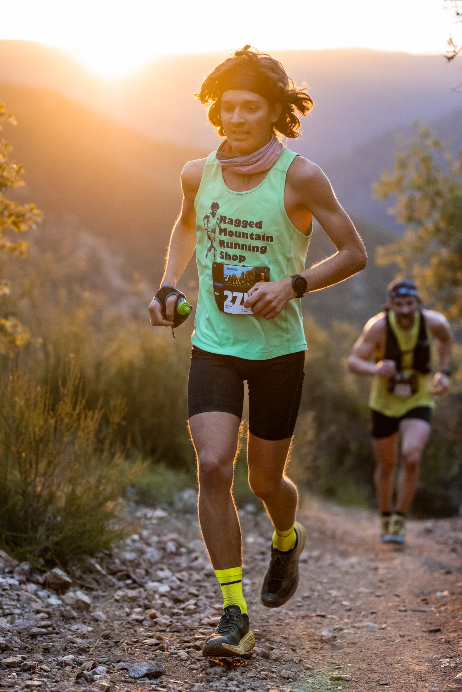

```{r, out.width="100%",echo=F,fig.align='center'}
knitr::include_graphics("images/emmett-caborder.jpeg")
```




I grew up in Cincinnati, OH before heading to the University of Virginia to study Economics and Commerce as an undergraduate. I went through college thinking that I would work in business and eventually go back and get an MBA, but my economics classes fascinated me so I took econ on as a second major. After graduating, I spent two years as a data scientist in Richmond, Va for CarMax. I soon found myself wanting the tools necessary to spend my time working on my own research, so I moved west and started my PhD at the University of Oregon in Eugene. 

When I was in high school, my awesome mom went and ran the Boston Marathon for the first time, and I hopped in the race to run with her for the last 4 miles. The following year, she was a half mile from the finish line when the bombs went off. Luckily she was ok, but the devastating day made me want to go and run the marathon myself. The next spring I ran the Charlottesville marathon, qualifying for Boston, which I then did for the first time in 2015. Since then I have run many more marathons, lowering my PB to 2:29:12.  

From a young age, I have loved spending time outside. I'd go on monthly camping trips with my friends, and every summer we'd have a big trip backpacking, canoeing, or otherwise adventuring. A significant portion of my childhood was spent playing in a small creek that was behind my house (and behind a friend's house when we moved away). The summer before I moved to Eugene, I hiked the entirety of the Pacific Crest Trail in 89 days. The trail stretches 2,650 miles from the Mexican to Canadian border through California, Oregon, and Washington. This was an incredible experience that is hard to put into words without sounding cliche. I try to remember the connectedness I felt between the trees, plants, soil, water, animals, and us humans every day. 

Since moving to Eugene, I have become more and more of a trail runner rather than a road runner. It's hard not to with so many awesome trails to run close to town. Summer of 2020, having passed the core exams after the first year of my PhD, I tried to squeeze in as many epic long runs as I could. This turned into circumnavigating 5 volcanoes, traversing the Tetons and Enchantments, and numerous other long days out on the trails with friends that I won't forget. This past summer I got into the ultra racing scene and ran a 100K, 50mi, and three 50K's, winning all but the 100K. 

I have been vegan for 4 years now and sober for 2. Both of these choices have significantly improved my life. I feel healthy and strong, and yes I eat enough protein. Going vegan sparked a love for cooking in me as it opened my eyes to a whole new set of fun and exciting recipes. More importantly though, I choose not to buy animal products because the animals are complex emotional beings that do not deserve to be treated the way they are presently.

I live in a 390 sq-ft tiny house with the most wonderful partner. She has gotten me into surfing and mushroom foraging, so we frequent the Oregon coast for its subpar waves and exceptional mushrooms.    


```{r, out.width="100%",echo=F,fig.align='center'}
knitr::include_graphics("images/or-trees.jpeg")
```

