```{r Setup, include = F}
options(htmltools.dir.version = FALSE)
library(pacman)
p_load(
  xaringan, ggthemes, viridis, knitr, dslabs, gapminder, extrafont, 
  Ecdat, wooldridge, tidyverse, magrittr, kableExtra, data.table
)

# Define colors
red_pink <- "#EC7662"
met_slate <- "#272822" 
turquoise <- "#20B2AA"
orange <- "#FFA500"
red <- "#fb6107"
blue <- "#2b59c3"
green <- "#8bb174"
grey_light <- "grey70"
grey_mid <- "grey50"
grey_dark <- "grey20"
purple <- "#6A5ACD"
slate <- "#314f4f"
# Notes directory

# Knitr options
opts_chunk$set(
  comment = "#>",
  fig.align = "center",
  fig.height = 7,
  fig.width = 10.5,
  warning = F,
  message = F,
  echo = FALSE
)  
opts_chunk$set(dev = "svg")
options(device = function(file, width, height) {
  svg(tempfile(), width = width, height = height)
})
options(crayon.enabled = F)
options(knitr.table.format = "html")
```

```{css, echo = F, eval = F}
@media print {
  .has-continuation {
    display: block !important;
  }
}
```

# Residential Solar Panels

Solar panel .hi-pink[subsidies] and .hi-pink[installation rates] vary significantly across states.

--

```{r subsidies, out.width = "75%", echo = FALSE}

knitr::include_graphics('figures/maps/descriptive/expected-subsidy.jpeg')

```

<center>Expected Subsidy</center>


$$\newcommand{\NERC}{\mathcal{R}}
\newcommand{\HC}{\ell}
\newcommand{\hours}{\tilde{\ell}}
\newcommand{\red}{\textcolor{red}}
\newcommand{\supply}{\mathcal{S}}
\newcommand{\amen}{\Gamma}
\newcommand{\DamOffSetExt}{\overrightarrow{\Delta D}^{\theta, \text{ext}}_j }
\newcommand{\DamOffSetInt}{\overrightarrow{\Delta D}^{\theta, \text{int}}_j}
\newcommand{\DamOffSetInd}{{\Delta D}_i}
\newcommand{\monetary}{\mu}
\newcommand{\nbar}{\bar{N}}
\newcommand{\subtype}{\theta}
\newcommand{\dmdstheta}{\mathbbm{1}^{\subtype_j}_{\rightarrow m_i }}
\newcommand{\dmdskWh}{\mathbbm{1}_{o_i \rightarrow m_i |s^{\text{KWh}}_j}}
\newcommand{\dmdscost}{\mathbbm{1}_{o_i \rightarrow m_i |s^{\text{Cost}}_j}}
\newcommand{\dmdsunit}{\mathbbm{1}_{o_i \rightarrow m_i |s^{\text{Unit}}_j}}
\newcommand{\dmndstheta}{\left(\dmdstheta N^{\star}_i + m_i^{\star} \frac{\partial N_i}{\partial s^{\subtype}_j}\right)}
\newcommand{\dmndskWh}{\left(\dmdskWh N^{\star}_i + m_i^{\star} \frac{\partial N_i}{\partial s^{\text{KWh}}_j}\right)}
\newcommand{\dmndscost}{\left(\dmdscost N^{\star}_i + m_i^{\star} \frac{\partial N_i}{\partial s^{\text{Cost}}_j}\right)}
\newcommand{\dmndsunit}{\left(\dmdsunit N^{\star}_i + m_i^{\star} \frac{\partial N_i}{\partial s^{\text{Unit}}_j}\right)}
\newcommand{\DRPrime}{D_R^{\prime} }
\newcommand{\DjPrime}{D_j^{\prime} }
\newcommand{\DjRPrime}{D_{jR}^{\prime} }
\newcommand{\DjRiPrime}{D_{jR(i)}^{\prime} }
\newcommand{\DA}{\mathit{A D^{\prime}}}
\newcommand{\RR}{\text{Solar} }
\newcommand{\CR}{\text{NonD} }
\newcommand{\CN}{\text{Disp} }
\newcommand{\FB}{\text{FB} }
\newcommand{\SB}{\text{SB} }
\newcommand{\shift}{\lambda }
\newcommand{\ExcessLoad}{\text{ELoad} }
\newcommand{\poll}{g}
\newcommand{\Poll}{G}
\newcommand{\margD}{\delta}
\newcommand{\damagesfunc}{d}
\newcommand{\Interconnection}{\mathbf{R}}$$

---
count: false
# Residential Solar Panels

Solar panel .hi-pink[subsidies] and .hi-pink[installation rates] vary significantly across states.

```{r install, out.width = "75%", echo = FALSE}

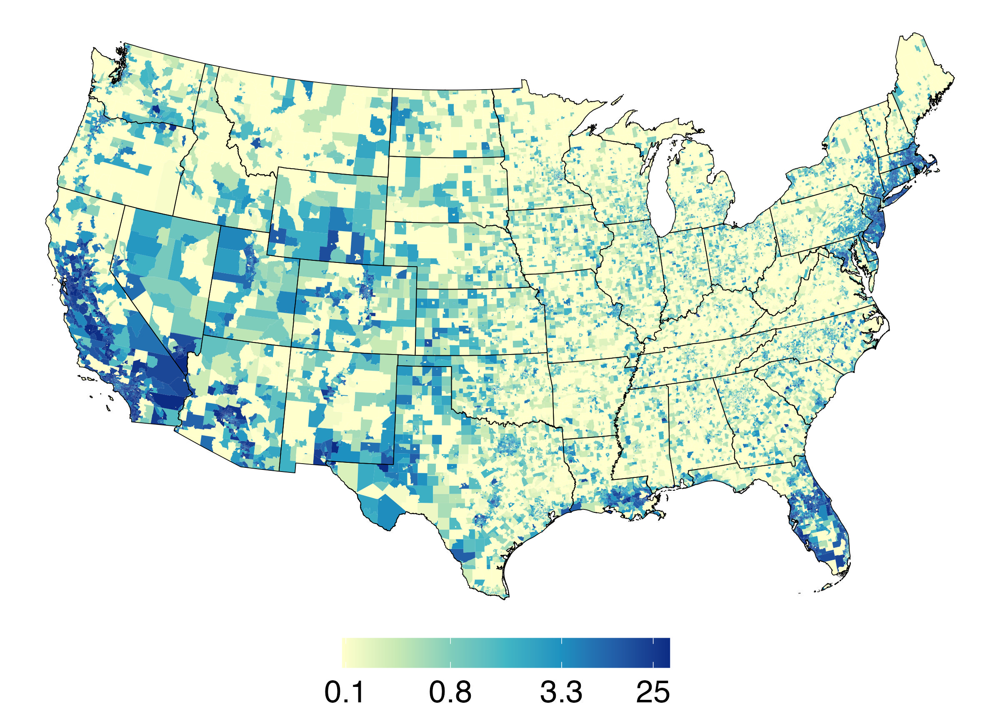

```

<center>Installations per 1000 HHs</center>

---
count: false
# Residential Solar Panels

Solar panel .hi-pink[subsidies] and .hi-pink[installation rates] vary significantly across states.  


The .hi-green[environmental benefits] also vary geographically.  

--

  - Variation in sunlight `r knitr::asis_output('\U2600')`  
  - Variation in the marginal damage of electricity production `r knitr::asis_output('\U1F3ED')`  

```{r sunlight, out.width = "50%", echo = FALSE}

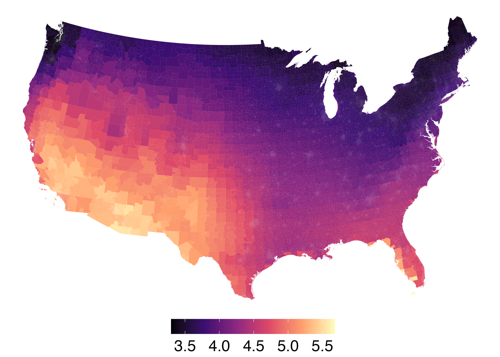

```

<center> .smaller[Daily Solar Radiation] </center>

---
count: false
# Residential Solar Panels

Solar panel .hi-pink[subsidies] and .hi-pink[installation rates] vary significantly across states.  


The .hi-green[environmental benefits] also vary geographically.  


  - Variation in sunlight `r knitr::asis_output('\U2600')`  
  - Variation in the marginal damage of electricity production `r knitr::asis_output('\U1F3ED')`  

<br> 


1. How should residential solar subsidies **optimally vary across space**?  
2. To what extent has the current system of subsidies led to a **spatial misallocation** of solar panels?


---
# Our approach 

### A structural model
- Heterogeneous .hi-pink[households] choose whether to install solar panels
--

- Households can also purchase electricity from the grid, which is produced by a set of heterogeneous .hi-pink[power plants]
--

- Installation of solar panels generates .hi-green[positive externalities] by offseting production from fossil-fuel power plants  


---
# Results preview   


<br>

.bigger[**1.** Current subsidies lead to severe .hi-pink[spatial misallocation] of solar panel installations in the U.S.]  

--
<br>

.bigger[**2.** Optimal cost-neutral reform increases aggregate environmental benefits by .hi-pink[6-11%]]  

--
<br>

.bigger[**3.** National funding for subsidies under the
current system exceeds the unconstrained optimum by over .hi-pink[ten-fold.]]  


---
class: inverse, middle

# A brief model overview  


---
# Households  


### Households live in a state    

- Face a set of electricity prices, installation prices, and menu of subsidies. Prices are all fixed over time and exogenous.  
- Heterogeneity: 
  - Solar technology (sunlight)  
  - Space for solar panels (rooftop space)  
  - Preferences for solar installation   

--
- Make once-and-for-all decision of how many panels to install, taking into account **lifetime costs and benefits**     


---
# Electricity production  
 
 
### Nondispatchable power plants (e.g. wind, solar)  
- Output driven by exogenous factors   
- Don't respond to demand for electricity  
- Don't lead to environmental damages  

--

### Dispatchable power plants  (e.g. coal, natural gas)  
- Fill residual demand after nondispatchable plants and residential solar   
- Heterogeneity:  
  - Environmental damages  
  - Production capacity  
  - Location   
- Specify plant-specific policy functions mapping excess electricity demand across grid `r knitr::asis_output("\U27A1")` plant-level electricity production   

---
# Government 


### Menu of subsidies at each state  
1. Production-based subsidies (e.g. renewable energy certificates)  
1. Cost-based subsidies (e.g. federal investment tax credit)  
1. Per-panel subsidies  

--

<br>

`r knitr::asis_output("\U2B06")` subsidy `r knitr::asis_output("\U23E9")`  `r knitr::asis_output("\U2B06")`   solar installations `r knitr::asis_output("\U23E9")`  `r knitr::asis_output("\U2B07")` dispatchable production `r knitr::asis_output("\U23E9")`  
`r knitr::asis_output("\U2B07")` damages

<br>

--

Choose the system of state subsidies to **maximize objective** subject to the governemnt's **budget constraint**  

---
class: inverse, middle

# Data and Estimation 

---
name: data-est-intro
# Data  

- **Residential solar installations** from Deepsolar, a remotely-sensed dataset on universe of US residential solar installations by census tract

--
- **Rooftop sizes** from Google Project Sunroof, a remotely-sensed dataset on solar irradiance and rooftop space suitable for solar by census tract

--
- **Current subsidies** from Database of State Incentives for Renewables & Efficiency (DSIRE) assembled by Sexton et. al. (2021)  

--
- **Power plant production and emissions:** from Open Grid Emissions (OGE), .purple[presented at 2022 TWEEDS by Greg Miller!]
  - Hourly electricity generation and emissions for over 10,000 power plants across the U.S. in 2019   
  - Pollutants are $NO_x$, $SO_2$, $PM2.5$, and $CO_2e$  
  - Gives us over 40 million plant-hour observations  

--
- **Environmental Damages:** from AP3, a state-of-the-art integrated assessment model, and the Social Cost of Carbon   


???

.smallest[ [GPS overview](#gps-example) ]
.smallest[ [DS overview](#deepsolar-overview) ] 


---
name:estimation-intro
# Estimation overview

- **Households**
  - GMM using Deepsolar and Google Project Sunroof data  
  - Target installation rate and size across all census tracts    
  - Identification from cross-sectional variation in returns to installation across tracts (sunlight, subsidies and prices)   

--
- **Power Plants**    
  - Production estimated with MLE (Tobit) using OGE data  
  - Emissions estimated as (power-plant specific) spline in production   
  - Use AP3 to convert emissions to damages  

--

### Validation  
- Replicate three quasi experimental estimates of the impact of subsidies on solar panel installations 
- Replicate power plant production over the course of the year  

.footnote[.smallest[[Model fit plots](#estimates-fit)]]


???


### Our estimated model is consistent with    
- Distribution of installation rates  
- Causally identified, quasi-experimental estimates on the effect of subsidies on solar panel installations  
- Power plant production over the course of the year    

### Use the model to find optimal subsidies    
- Choose set of state level subsidies to maximize the gov't objective  
- **Quantify:** How severe is misallocation caused by current system of subsidies? What would be the environmental benefits of switching to the optimal system of subsidies?  


---
class: inverse, middle

# Results 

---
# Cost-neutral optimal subsidies  


```{r optimal, out.width = "80%", echo = FALSE}

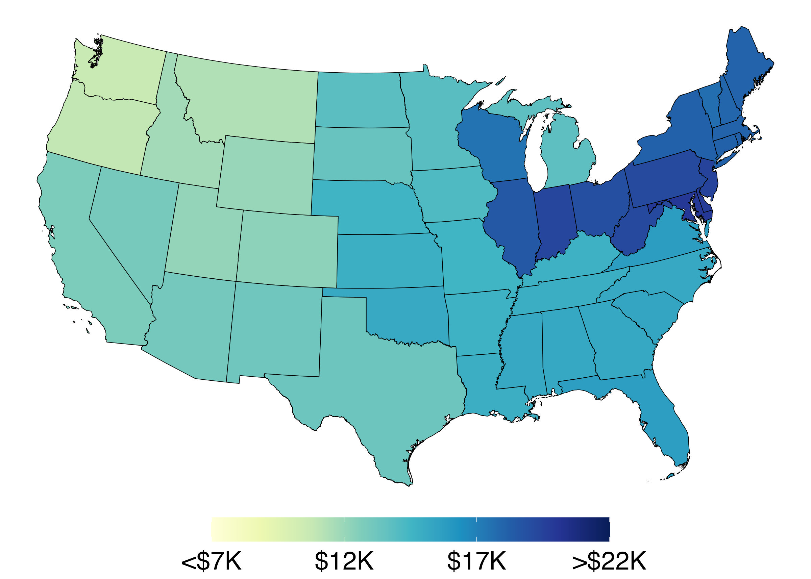

```

<center>Welfare Maximizing Subsidies</center>


---
# Spatial misallocation of installations     


```{r optrelbase, out.width = "80%", echo = FALSE}

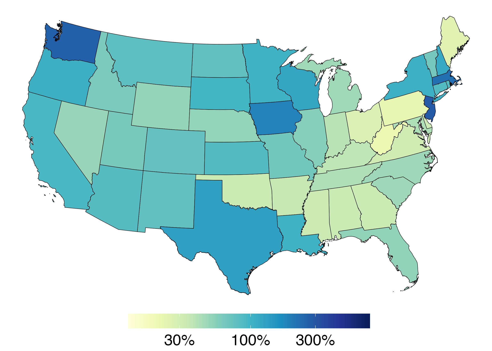

```

<center>Baseline installations as a percent of optimal</center>


---
# Unconstrained reforms

Optimal subsidy levels drop significantly without cost-neutral constraint. 

--

```{r unconstr}

subs_dt = data.table(
  row = c('baseline','optimal','baseline','optimal'),
  match_order = c(1,2,3,4),
  Midwest = c(11.3, 5.4,11.3,11.5),
  Northeast = c(18.2,6.5,18.2,13.6),
  South = c(10.4,4.5,10.4,10.9),
  West = c(12.0,3.0,12.0,8.2),
  Midwest = c(4.1,1.8,4.1,3.7),
  Northeast = c(29.8,5.0,29.8,11.5),
  South = c(6.8,3.2,6.8,6.8),
  West = c(13.2, 4.7,13.2,8.6),
  National = c(11.4,3.6,11.4,7.4),
  `Damages Offset ($Millions)` = c(141.7,42.3,325.1,207.3),
  `Fiscal Cost ($Millions)` = c(495.1,42.3,495.1,207.1)
)

subs_dt[order(match_order),12:13] |>
  t() |>
  kbl(align = 'ccccc') |>
  add_header_above(c('',' Baseline ',' Optimal ',' Baseline ',' Optimal ')) |>
  add_header_above(c(' '=1, 'SCC = $51' = 2, 'SCC = $185' = 2))  |>
  #row_spec(5, bold = TRUE) |>
  row_spec(1, color =  red_pink) |>
  row_spec(2, color =  purple) |>
  column_spec(c(1,4,5), color = 'black')

```


- We can achieve .hi-pink[30%] of the benefits at .hi-purple[~10%] of the cost  

---
# Unconstrained reforms

Optimal subsidy levels drop significantly without cost-neutral constraint. 

```{r unconstr2}

subs_dt[order(match_order),12:13] |>
  t() |>
  kbl(align = 'ccccc') |>
  add_header_above(c('',' Baseline ',' Optimal ',' Baseline ',' Optimal ')) |>
  add_header_above(c(' '=1, 'SCC = $51' = 2, 'SCC = $185' = 2))  |>
  #row_spec(5, bold = TRUE) |>
  row_spec(1, color =  red_pink) |>
  row_spec(2, color =  purple) |>
  column_spec(c(1, 2,3), color = 'black')

```


- We can achieve **30%** of the benefits at **~10%** of the cost  
- However...  
  - Sensitive to choice of SCC   
  - Get .hi-pink[64%] of benefits at .hi-purple[42%] of cost under higher SCC   
  - Does not include all potential benefits of residential solar 


---
name:results-summary
# Much more in the paper! 

### We also show results for 
- Damage minimizing subsidies  
- Benefits of marginal subsidy increases around current levels  
- Compare tract and state-level subsidies  

--

### Robustness checks    

Our results hold across various alterations/extensions...    

- Alternative household utility functions   
- Accounting for line losses  
- Improved storage technology (i.e. batteries)  
- Cleaner grid        


---
# Conclusion  


We use novel datasets on solar panel installations and power plant emissions to quantify the spatial misallocation in solar installations caused by current subsidies.  

--

- Currently the US **over-subsidizes** clean states (Washington) and **under-subsidizes** dirty states (Pennsylvania)  
- Optimal cost-neutral reform increases environmental benefits by **6-11%**  
- Subsidy levels are currently an order of magnitude higher than is justified by damages from emissions alone  


---
class: inverse, middle 
# Thank you!  

.hi-pink[Emmett Saulnier]
.pink[
  PhD Candidate, University of Oregon  
  ORISE Research Fellow, US EPA Office of Water  
]

.pink[
  emmetts@uoregon.edu  
  https://www.emmettsaulnier.com  
]

---
count: false
class: inverse, middle
# Appendix 


---
class: inverse, middle
# Model

---
# Household setup 

### Household $i$ in state $j$      
-  Choose whether to install solar panels $m_i \in \left\{0,1 \right\}$   
- Number of panels conditional on installation $N_i \in \left(0, \nbar_i\right]$  
- Each panel  produces stream of electricity $\left\{ A_{it} \right\}_{t=0}^T$ throughout the life of the panel (25 years).  

--
- Choose path of electricity consumption each period $\left\{ e_{it} \right\}_{t=0}^T$  
- Assume electricity bought and sold at $p_j$
- ${e_i}=\sum_{t=0}^T \frac{e_{it}}{\left(1+r\right)^t}$ discounted sum of electricity consumed
-  ${A_i}=\sum_{t=0}^T \frac{A_{it}}{\left(1+r\right)^t}$ discounted sum of electricity produced 


---
# Net present value budget constraint  

Net present value budget constraint:

$$c_i+ \underbrace{ p_j \left( e_i - m_i N_i  {A_i}  \right) }_{\text{Net cost of electricity}} + \underbrace{  m_i\left(1-{s_j^{\text{Cost}}}\right) {p^{\text{Ins}}_{j}\left(N_i \right)}}_{\text{Net cost of installation}}= \\
 y_i + \underbrace{ m_i N_i A_i {s^{\text{KWh}}_j}}_{\text{KWh Subsidy}}+  \underbrace{ m_i N_i  {s^{\text{Unit}}_j}}_{\text{Unit Subsidy}}.$$

- ${c_i}$: Consumption of numeraire good  
- ${p^{\text{Ins}}_{j}\left(N_i \right)}$: Cost of installing $N_i$ panels   
- ${y_i}$: Income (exogenous)  
- ${s_j^{\text{Cost}}}$: Per dollar installation subsidy  
- ${s^{\text{KWh}}_j}$: Per KWh subsidy  
- ${s^{\text{Unit}}_j}$: Per panel subsidy  


---
count: false
# Net present value budget constraint  

Net present value budget constraint:

$$c_i+ \color{#EC7662}{\underbrace{ p_j \left( e_i - m_i N_i  {A_i}  \right) }_{\text{Net cost of electricity}}} + \underbrace{  m_i\left(1-{s_j^{\text{Cost}}}\right) {p^{\text{Ins}}_{j}\left(N_i \right)}}_{\text{Net cost of installation}}= \\
 y_i + \underbrace{ m_i N_i A_i {s^{\text{KWh}}_j}}_{\text{KWh Subsidy}}+  \underbrace{ m_i N_i  {s^{\text{Unit}}_j}}_{\text{Unit Subsidy}}.$$

- ${c_i}$: Consumption of numeraire good  
- ${p^{\text{Ins}}_{j}\left(N_i \right)}$: Cost of installing $N_i$ panels   
- ${y_i}$: Income (exogenous)  
- ${s_j^{\text{Cost}}}$: Per dollar installation subsidy  
- ${s^{\text{KWh}}_j}$: Per KWh subsidy  
- ${s^{\text{Unit}}_j}$: Per panel subsidy  

---
count: false
# Net present value budget constraint  

Net present value budget constraint:

$$c_i+ \underbrace{ p_j \left( e_i - m_i N_i  {A_i}  \right) }_{\text{Net cost of electricity}} + \color{#EC7662}{\underbrace{  m_i\left(1-{s_j^{\text{Cost}}}\right) {p^{\text{Ins}}_{j}\left(N_i \right)}}_{\text{Net cost of installation}}}= \\
 y_i + \underbrace{ m_i N_i A_i {s^{\text{KWh}}_j}}_{\text{KWh Subsidy}}+  \underbrace{ m_i N_i  {s^{\text{Unit}}_j}}_{\text{Unit Subsidy}}.$$

- ${c_i}$: Consumption of numeraire good  
- ${p^{\text{Ins}}_{j}\left(N_i \right)}$: Cost of installing $N_i$ panels   
- ${y_i}$: Income (exogenous)  
- ${s_j^{\text{Cost}}}$: Per dollar installation subsidy  
- ${s^{\text{KWh}}_j}$: Per KWh subsidy  
- ${s^{\text{Unit}}_j}$: Per panel subsidy  

---
count: false
# Net present value budget constraint  

Net present value budget constraint:

$$c_i+ \underbrace{ p_j \left( e_i - m_i N_i  {A_i}  \right) }_{\text{Net cost of electricity}} + \underbrace{  m_i\left(1-{s_j^{\text{Cost}}}\right) {p^{\text{Ins}}_{j}\left(N_i \right)}}_{\text{Net cost of installation}}= \\
 y_i + \color{#EC7662}{\underbrace{ m_i N_i A_i {s^{\text{KWh}}_j}}_{\text{KWh Subsidy}}+  \underbrace{ m_i N_i  {s^{\text{Unit}}_j}}_{\text{Unit Subsidy}}}.$$

- ${c_i}$: Consumption of numeraire good  
- ${p^{\text{Ins}}_{j}\left(N_i \right)}$: Cost of installing $N_i$ panels   
- ${y_i}$: Income (exogenous)  
- ${s_j^{\text{Cost}}}$: Per dollar installation subsidy  
- ${s^{\text{KWh}}_j}$: Per KWh subsidy  
- ${s^{\text{Unit}}_j}$: Per panel subsidy  

---
# Utility Function   


Quasilinear utility function

$$c_i+ \nu_i\left( \left\{ e_{it} \right\}_{t=0}^T \right) + m_i \gamma_i \left(N_i\right)$$
     

- $\nu_i\left(\cdot \right)$: Lifetime utility from electricity use  
- $\gamma_i \left(N_i\right)$: Nonpecuniary benefit of adding $N_i$ solar panels  

---
count: false
# Utility Function   


Quasilinear utility function

$$c_i+ \color{#EC7662}{\nu_i\left( \left\{ e_{it} \right\}_{t=0}^T \right)} + m_i \gamma_i \left(N_i\right)$$
     

- $\color{#EC7662}{\nu_i\left(\cdot \right)}$: Lifetime utility from electricity use  
- $\gamma_i \left(N_i\right)$: Nonpecuniary benefit of adding $N_i$ solar  panels  


---
count: false
# Utility Function   


Quasilinear utility function

$$c_i+ \nu_i\left( \left\{ e_{it} \right\}_{t=0}^T \right) + \color{#EC7662}{m_i \gamma_i \left(N_i\right)}$$
     

- $\nu_i\left(\cdot \right)$: Lifetime utility from electricity use  
- $\color{#EC7662}{\gamma_i \left(N_i\right)}$: Nonpecuniary benefit of adding $N_i$ solar  panels  


---
count: false 
# Utility Function   


Quasilinear utility function

$$c_i+ \nu_i\left( \left\{ e_{it} \right\}_{t=0}^T \right) + m_i \gamma_i \left(N_i\right)$$
     

- $\nu_i\left(\cdot \right)$: Lifetime utility from electricity use  
- $\gamma_i \left(N_i\right)$: Nonpecuniary benefit of adding $N_i$ solar panels  
- Note that the choice of electricity consumption $\left\{ e_{it} \right\}_{t=0}^T$ is seperable from installation decision: choice of consumption does not affect installation decisions  
    
---
# Utility Function  

#### Households are solving a two step problem  
1. Choose stream of electricity usage  
1. Make installation decision and number of panels to install  

--

$$V_i=\max_{N_i, m_i \in \left\{0,1 \right\}} m_i 
\left[ \underbrace{\monetary_{ij}\left(N^{}_i\right)}_{\text{Monetary}} + \underbrace{\gamma_i\left(N^{}_i\right)}_{\text{Nonpecuniary}} \right]$$

---
count: false
# Utility Function  

#### Households are solving a two step problem  
1. Choose stream of electricity usage  
1. Make installation decision and number of panels to install  


$$V_i=\max_{N_i, m_i \in \left\{0,1 \right\}} m_i 
\left[ \color{#EC7662}{\underbrace{\monetary_{ij}\left(N^{}_i\right)}_{\text{Monetary}}} + \underbrace{\gamma_i\left(N^{}_i\right)}_{\text{Nonpecuniary}} \right]$$


where the monetary value is given by 

$\color{#EC7662}{\monetary_{ij}\left(N^{}_i\right)= \underbrace{N^{}_i  A_i  \left(p_j+ s_j^{\text{KWh}} \right)}_{\text{electricity value}} - \underbrace{\left(1-s_j^{\text{Cost}}\right)p^{\text{Ins}}_{j}\left(N^{}_i \right)}_{\text{installation cost}}+\underbrace{ N^{}_i s^{\text{Unit}}_j}_{\text{unit subsidy}}}$ 


---
# Electricity overview 

### Three sources of electricity  
1. Residential solar   
1. Commercial nondispatchable (e.g. wind and solar)   
1. Commercial dispatchable (e.g. coal and natural gas)   

--

.hi-pink[Excess load:] Electricity demand that is not satisfied by residential solar or commercial nondispatchable sources.

---
name:dispatchable-production
# Dispatchable Production   

### Production by dispatchable plant $k$ in time $t$:   
$$y^{\CN}_{kt} = \begin{cases}
  0  & \text{if } f^{}_{k}\left(\ExcessLoad_t, \varepsilon_{kt}\right) \leq 0 \\
  f^{}_{k}\left(\ExcessLoad_t, \varepsilon_{kt}\right) & \text{if } 0 < f^{}_{k}\left(\ExcessLoad_t, \varepsilon_{kt}\right) < \bar{y}^{}_{k} \\
  \bar{y}^{}_{k}  & \text{if } f^{}_{k}\left(\ExcessLoad_t, \varepsilon_{kt}\right) \geq \bar{y}^{}_{k} 
\end{cases}$$

- $f_k$ is a flexible power-plant specific production function  
- $\ExcessLoad_t$ is a vector of excess loads across [geographic regions](#nerc-map) in time $t$  
- $\bar{y}^{}_{k}$ is production capacity of plant  
  
--

### Damages  

- $\damagesfunc_{k}\left(y^{\text{Disp}}_{kt} \right)$: environmental damages by plant $k$  
- $D\left(\ExcessLoad \right)=\sum_{t=0}^T \frac{\sum_k \damagesfunc_{kt} \left(y^{\text{Disp}}_{kt}\right)}{\left(1+r\right)^t}$: PDV of aggregate damages


---
# Optimal Subsidies  
Government maximizes sum of utility less environmental damages:
$$\underbrace{\int_i  V_i h(i) di}_{\text{Utility}} - \underbrace{D\left(\ExcessLoad \right)}_{\text{Damages}}$$

subject to budget constraint

$$\underbrace{\sum_j \int_{i \in I_j} s_{ij} m^{\star}_i h(i) di}_{\text{Government Cost}} \leq G$$

--

- $h(i)$: density of household type $i$  
- $I_j$: set of households in state $j$  
- $s_{ij}=  s^{\text{Unit}}_j N_i^{\star}+s^{\text{kWh}}_j A_i N_i^{\star} + s^{\text{Cost}}_j p^{\text{Ins}}_{j}\left(N_i^{\star} \right)$: total subsidy paid to HH $i$ 
- Planner chooses $s^{\subtype}_j$ for each type of subsidy $\subtype$ and each state $j$.  


---
# Planner's FOC  

Optimal subsidies must satisfy 

$$\small \underbrace{\frac{\partial M^{\text{}}_j}{\partial s^{\subtype}_j}  \times \left(\DamOffSetExt - \lambda \overrightarrow{s_{}}^{\theta,\text{ext}}_j \right)}_{\text{Extensive Margin}} + \underbrace{\frac{\partial N^{\text{}}_j}{\partial s^{\subtype}_j} \Bigg|_{M^{\text{st}}_j} \times \left(\DamOffSetInt - \lambda \overrightarrow{\frac{\partial s}{\partial N}}^{\theta,\text{int}}_j \right)}_{\text{Intensive Margin}} + \underbrace{ \left(1-\lambda \right) M_j \overline{\frac{\partial s_{ij}}{\partial s^{\subtype}_j  }} }_{\text{Mechanical Effect}} =0.$$


- $\small\frac{\partial M^{\text{}}_j}{\partial s^{\subtype}_j}$ is number of marginal installers  
- $\small\DamOffSetExt$ is the average damages offset of switchers  
- $\small\overrightarrow{s_{}}^{\theta,\text{ext}}_j$ is the average subsidy received by switchers  
- $\small\lambda$ is the marginal value of public funds  
- $\small\frac{\partial N^{\text{}}_j}{\partial s^{\subtype}_j} \Big|_{M^{\text{st}}_j}$ is the number of marginal panels  
- $\small\DamOffSetInt$ and $\small\overrightarrow{\frac{\partial s}{\partial N}}^{\theta,\text{int}}_j$ avg damages offset/subsidy paid to marginal panel  
- $\small\overline{\frac{\partial s_{ij}}{\partial s^{\subtype}_j  }}$ is the increase in subsidy paid to inframarginal households 

---
count: false 
# Planner's FOC  

Optimal subsidies must satisfy 

$$\small \color{#EC7662}{\underbrace{\frac{\partial M^{\text{}}_j}{\partial s^{\subtype}_j}  \times \left(\DamOffSetExt - \lambda \overrightarrow{s_{}}^{\theta,\text{ext}}_j \right)}_{\text{Extensive Margin}}} + \underbrace{\frac{\partial N^{\text{}}_j}{\partial s^{\subtype}_j} \Bigg|_{M^{\text{st}}_j} \times \left(\DamOffSetInt - \lambda \overrightarrow{\frac{\partial s}{\partial N}}^{\theta,\text{int}}_j \right)}_{\text{Intensive Margin}} + \underbrace{ \left(1-\lambda \right) M_j \overline{\frac{\partial s_{ij}}{\partial s^{\subtype}_j  }} }_{\text{Mechanical Effect}} =0.$$


- $\small\color{#EC7662}{\frac{\partial M^{\text{}}_j}{\partial s^{\subtype}_j}}$ is number of marginal installers  
- $\small\color{#EC7662}{\DamOffSetExt}$ is the average damages offset of switchers  
- $\small\color{#EC7662}{\overrightarrow{s_{}}^{\theta,\text{ext}}_j}$ is the average subsidy received by switchers  
- $\small\lambda$ is the marginal value of public funds  
- $\small\frac{\partial N^{\text{}}_j}{\partial s^{\subtype}_j} \Big|_{M^{\text{st}}_j}$ is the number of marginal panels  
- $\small\DamOffSetInt$ and $\small\overrightarrow{\frac{\partial s}{\partial N}}^{\theta,\text{int}}_j$ avg damages offset/subsidy paid to marginal panel  
- $\small\overline{\frac{\partial s_{ij}}{\partial s^{\subtype}_j  }}$ is the increase in subsidy paid to inframarginal households 

---
count: false
# Planner's FOC  

Optimal subsidies must satisfy 

$$\small \underbrace{\frac{\partial M^{\text{}}_j}{\partial s^{\subtype}_j}  \times \left(\DamOffSetExt - \lambda \overrightarrow{s_{}}^{\theta,\text{ext}}_j \right)}_{\text{Extensive Margin}} + \color{#EC7662}{\underbrace{\frac{\partial N^{\text{}}_j}{\partial s^{\subtype}_j} \Bigg|_{M^{\text{st}}_j} \times \left(\DamOffSetInt - \lambda \overrightarrow{\frac{\partial s}{\partial N}}^{\theta,\text{int}}_j \right)}_{\text{Intensive Margin}}} + \underbrace{ \left(1-\lambda \right) M_j \overline{\frac{\partial s_{ij}}{\partial s^{\subtype}_j  }} }_{\text{Mechanical Effect}} =0.$$


- $\small\frac{\partial M^{\text{}}_j}{\partial s^{\subtype}_j}$ is number of marginal installers  
- $\small\DamOffSetExt$ is the average damages offset of switchers  
- $\small\overrightarrow{s_{}}^{\theta,\text{ext}}_j$ is the average subsidy received by switchers  
- $\small\lambda$ is the marginal value of public funds  
- $\small\color{#EC7662}{\frac{\partial N^{\text{}}_j}{\partial s^{\subtype}_j} \Big|_{M^{\text{st}}_j}}$ is the number of marginal panels  
- $\small\color{#EC7662}{\DamOffSetInt}$ and $\small\color{#EC7662}{\overrightarrow{\frac{\partial s}{\partial N}}^{\theta,\text{int}}_j}$ avg damages offset/subsidy paid to marginal panel  
- $\small\overline{\frac{\partial s_{ij}}{\partial s^{\subtype}_j  }}$ is the increase in subsidy paid to inframarginal households 


---
count: false
# Planner's FOC  

Optimal subsidies must satisfy 

$$\small \underbrace{\frac{\partial M^{\text{}}_j}{\partial s^{\subtype}_j}  \times \left(\DamOffSetExt - \lambda \overrightarrow{s_{}}^{\theta,\text{ext}}_j \right)}_{\text{Extensive Margin}} + \underbrace{\frac{\partial N^{\text{}}_j}{\partial s^{\subtype}_j} \Bigg|_{M^{\text{st}}_j} \times \left(\DamOffSetInt - \lambda \overrightarrow{\frac{\partial s}{\partial N}}^{\theta,\text{int}}_j \right)}_{\text{Intensive Margin}} + \color{#EC7662}{\underbrace{ \left(1-\lambda \right) M_j \overline{\frac{\partial s_{ij}}{\partial s^{\subtype}_j  }} }_{\text{Mechanical Effect}}} =0.$$


- $\small\frac{\partial M^{\text{}}_j}{\partial s^{\subtype}_j}$ is number of marginal installers  
- $\small\DamOffSetExt$ is the average damages offset of switchers  
- $\small\overrightarrow{s_{}}^{\theta,\text{ext}}_j$ is the average subsidy received by switchers  
- $\small\lambda$ is the marginal value of public funds  
- $\small\frac{\partial N^{\text{}}_j}{\partial s^{\subtype}_j} \Big|_{M^{\text{st}}_j}$ is the number of marginal panels  
- $\small\DamOffSetInt$ and $\small\overrightarrow{\frac{\partial s}{\partial N}}^{\theta,\text{int}}_j$ avg damages offset/subsidy paid to marginal panel  
- $\small\color{#EC7662}{\overline{\frac{\partial s_{ij}}{\partial s^{\subtype}_j  }}}$ is the increase in subsidy paid to inframarginal households 


???
Formally \hyperlink{FormalDefs}{\beamergotobutton{Formally}}


---
class: inverse, middle
# Quantitative Model 


---
# Households 

Household installation decision:

$$V_i=\max_{N_i, m_i \in \left\{0,1 \right\}}  m_i \left[ \monetary_{ij}\left(N_i^{} \right) + \gamma_i \left(N_i^{} \right) \right].$$

---
count: false
# Households 

Household installation decision:

$$V_i=\max_{N_i, m_i \in \left\{0,1 \right\}}  m_i \left[ \monetary_{ij}\left(N_i^{} \right) + \color{#EC7662}{\gamma_i \left(N_i^{} \right)} \right].$$

Parameterize non-pecuniary value of installation as

$$\color{#EC7662}{\gamma_i\left(N_i \right)=\underbrace{\gamma_0 +\gamma_{1N} N_i +   \gamma_{2N} N^2_i}_{\text{Polynomial in } N_i} + \underbrace{\gamma_{dem} X_{\ell} }_{\text{Local Demographics}} + \underbrace{\sigma \varepsilon_i}_{\text{Idiosyncratic}}}$$


- $X_{\ell}$: vector of demographics at household's census tract, $\ell$  

--
- $\varepsilon_i$: logit idiosyncratic term   

---
# Household choices  


### Optimal number of panels  
Conditional on installation, households will choose $N^{\star}$ panels  

$$N^{\star}_i=\min \left[ \nbar_i ,-\left(\frac{ \frac{\partial \mu_{ij}}{\partial N_i} + \gamma_{1N}}{ 2 \gamma_{2N}}\right) \right]$$

--

### Probability of installation  

$$\pi_i=\frac{ \exp\left(\frac{  \mu_i + \gamma_0 + \gamma X_{\ell}  + \left(\gamma_{1N} N^{\star}_i +   \gamma_{2N} N^{\star  2}_i \right) }{\sigma}\right)}{1+ \exp\left(\frac{ \mu_i+ \gamma_0 + \gamma X_{\ell}  + \left(\gamma_{1N} N^{\star}_i +   \gamma_{2N} N^{\star 2}_i \right) }{\sigma}\right)}.$$


---
# Dispatchable power plant production  

### Power plant policy functions  
Production by these dispatchable plants $k$ in time $t$ is 

$$y^{\CN}_{kt} = \begin{cases} 0  & \text{if } f^{}_{k}\left(\ExcessLoad_t, \varepsilon_{kt}\right) \leq 0 \\ f^{}_{k}\left(\ExcessLoad_t, \varepsilon_{kt}\right) & \text{if } 0 < f^{}_{k}\left(\ExcessLoad_t, \varepsilon_{kt}\right) < \bar{y}^{}_{k} \\ \bar{y}^{}_{k}  & \text{if } f^{}_{k}\left(\ExcessLoad_t, \varepsilon_{kt}\right) \geq \bar{y}^{}_{k} \end{cases}$$


---
count: false
# Dispatchable power plant production  

### Power plant policy functions  
Production by these dispatchable plants $k$ in time $t$ is 

$$y^{\CN}_{kt} = \begin{cases} 0  & \text{if } f^{}_{k}\left(\ExcessLoad_t, \varepsilon_{kt}\right) \leq 0 \\ \color{#EC7662}{f^{}_{k}\left(\ExcessLoad_t, \varepsilon_{kt}\right)} & \text{if } 0 < f^{}_{k}\left(\ExcessLoad_t, \varepsilon_{kt}\right) < \bar{y}^{}_{k} \\ \bar{y}^{}_{k}  & \text{if } f^{}_{k}\left(\ExcessLoad_t, \varepsilon_{kt}\right) \geq \bar{y}^{}_{k} \end{cases}$$

We specify that  


$$\color{#EC7662}{f^{}_{k}\left(\ExcessLoad_t , \varepsilon_{kt}\right)=\lambda^0_k + \sum_{R \in \Interconnection_k} \left( \lambda^1_{Rk}\ExcessLoad_{Rt}  + \lambda^2_{Rk}\ExcessLoad_{Rt}^2 \right)+ \varepsilon_{kt}}$$


- $\Interconnection_k$ is the set of NERC regions within the interconnection which contains plant $k$  
- $\varepsilon_{kt}$ is a normally distributed shifter  

---
class: inverse, middle
# Data and Estimation


---
name: data-overview
# Data overview


- **Solar panel installations:** Deepsolar database (Yu et al. 2018). [Overview](#deepsolar-overview)  
  - Tract-level number of residential solar systems  
  - Tract-level total installed panel area  

--
- **Rooftop sizes:** Google Project Sunroof (GPS) has area suitable for solar panels within census tracts (analog of $\bar{N}_i$). [Example](#gps-example)  

--
- **Solar irradiance:** Combination of GPS for annual values, and the System Advisor Model (SAM), for [time profile](#time-profile) of each hour of the year

--
- **Current subsidies:** Database of State Incentives for Renewables & Efficiency
(DSIRE) assembled by Sexton et. al. (2021)  

--
- **Electricity prices:** average retail price by state from EIA. [Map](#descr-electricity-prices)
- **Installation price function:** Estimated regionally using installation data from Tracking the Sun. [Regression results](#install-price-reg)


---
# Data overview pt. 2

- **Power plant production and emissions:** 
  - Open Grid Emissions (OGE) has hourly electricity generation and emissions for over 10,000 power plants across the U.S. in 2019   
  - Pollutants are $NO_x$, $SO_2$, $PM2.5$, and $CO_2e$  
  - Gives us over 40 million plant-hour observations  

--
- **Damages:** 
  - AP3 is a state-of-the-art integrated assessment model  
  - Accounts only for human health damages 
  - Use a $51/ton social cost of carbon 

---
name: deepsolar-overview
# Deepsolar overview

```{r deepsolar, out.width = "60%", echo = FALSE}

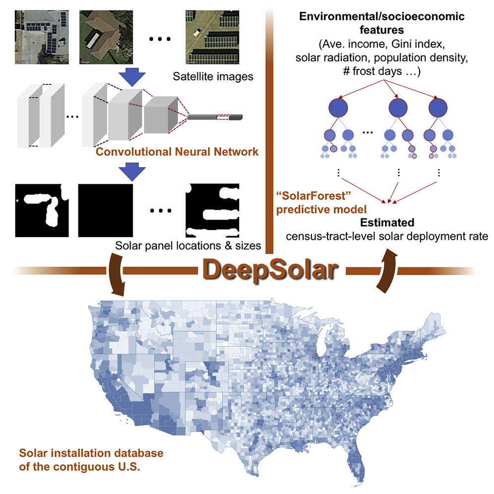

```


.footnote[ [Intro](#data-est-intro) [Data](#data-overview)]

---
name: gps-example
# Google Project Sunroof Example

```{r gps, out.width = "100%", echo = FALSE}

knitr::include_graphics('figures/gps-screenshot.png')

```

.footnote[ [Intro](#data-est-intro) [Data](#data-overview)]

---
name: nerc-map
# NERC Region Map 

```{r nerc, out.width = "90%", echo = FALSE}

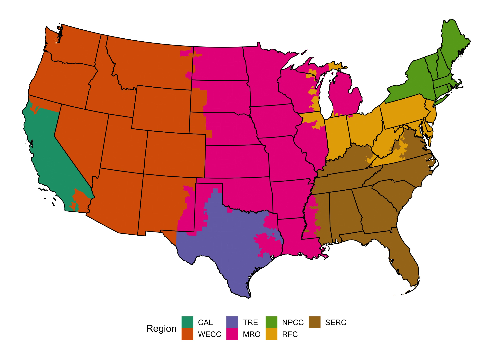

```

.footnote[ [Model](#dispatchable-production)]


---
# Estimation overview

### Households  

- GMM using Deepsolar and GPS data  
- **Target:** installation rate and size of installations across all census tracts    
- **Identification:** cross-sectional variation in returns to installation across tracts (sunlight, subsidies and prices)   

--

### Power Plants  
- MLE (Tobit) using OGE data  
- Emissions estimated as (power-plant specific) spline in production   
- Use AP3 to convert emissions to damages  

---
name: estimates-fit
# Estimates and fit   

#### Despite being sparsely parameterized, both the household and power plant models fit the data very well. 

- Household parameter estimates: [Details](#parameter-estimates) 
- Installations across households: [Details](#demographic-fit)   
- Installations across states: [Details](#state-fit)   
- Quasi-experimental studies on installations: [Details](#quasi-experimental)    
- Why do installation rates vary across states? [Details](#decomposition) 
- Power plant production: [Details](#ic-hour-season-fit)   
- Marginal Damages: [Details](#marginal-damages)   
- Mix of plant fuel type: [Details](#fuel-mix)   

.footnote[.smallest[[Estimation Overview](#estimation-intro)]]

---
name: descr-electricity-prices
# Electricity Prices  

```{r elec-prices, out.width = "90%", echo = FALSE}

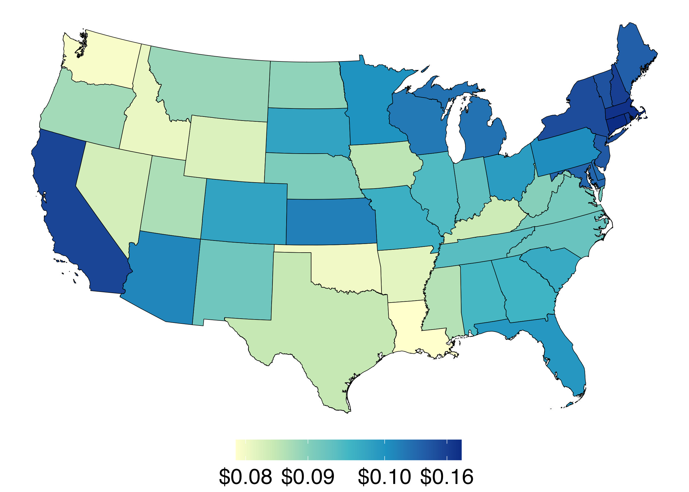

```

.footnote[ [Data](#data-overview)]

---
name: descr-expected-monetary-benefit
# Expected Monetary Benefit 

```{r emb, out.width = "90%", echo = FALSE}

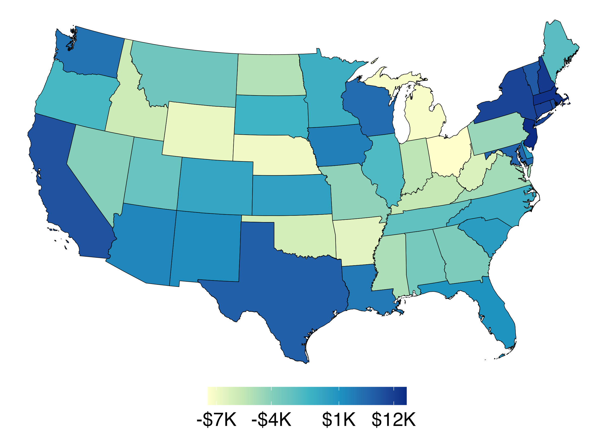

```

.footnote[ [Data](#data-overview)]

---
name: time-profile
# SAM hourly profiles  

```{r sam, out.width = "90%", echo = FALSE}

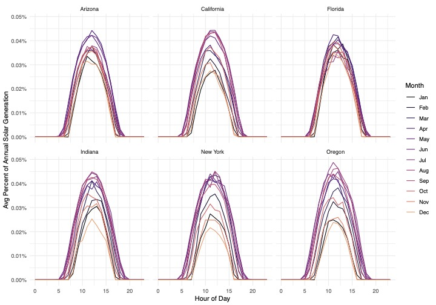

```

.footnote[ [Data](#data-overview)]

---
name: install-price-reg
# Installation price estimation  

```{r installprice, out.width = "90%", echo = FALSE}

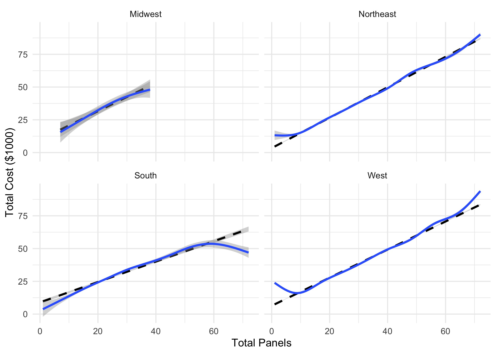

```


.footnote[ [Data](#data-overview)]

---
name: parameter-estimates 
# Parameter Estimates  

|     | | Estimate | Standard Error |
|:---|:--:|:----:|:---:|
| Dispersion of Idiosyncratic Utility | $\sigma$ | 8.55 | 0.08 |
| Percent College | $\gamma_{Coll}$ | 5.71 | 0.36 |
| Percent Democrat | $\gamma_{Pol}$ | 10.44 | 0.50 |
| Constant | $\gamma_{0}$ | -1357.03 | 411.27 |
| Number of Panels | $\gamma_{1N}$ | 177.70 | 55.65 |
| Number of Panels Squared | $\gamma_{2N}$ | -6.00 | 1.88 |

.footnote[ [Fit](#estimates-fit)]

---
name: demographic-fit
# Fit by demographic 

.pull-left[
```{r fitcol, out.width = "90%", echo = FALSE}

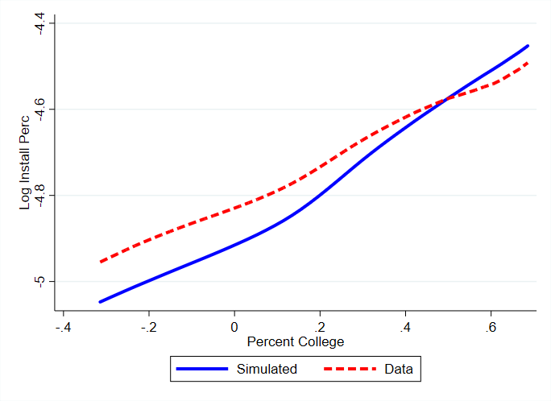

```
]

.pull-right[
```{r fitpol, out.width = "90%", echo = FALSE}

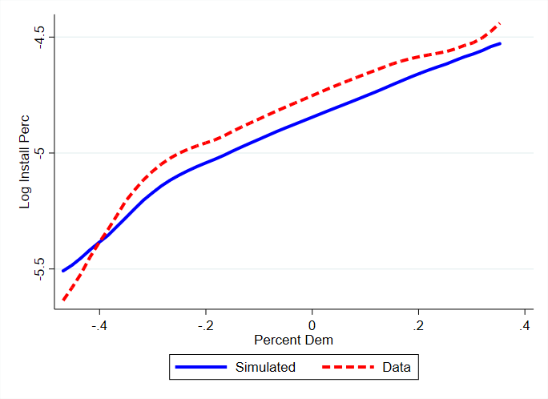

```
]

```{r fitben, out.width = "45%", echo = FALSE}

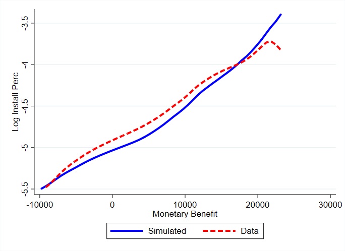

```

.footnote[ [Fit](#estimates-fit)]

---
name: state-fit
# Fit by State 

```{r fitstate, out.width = "75%", echo = FALSE}

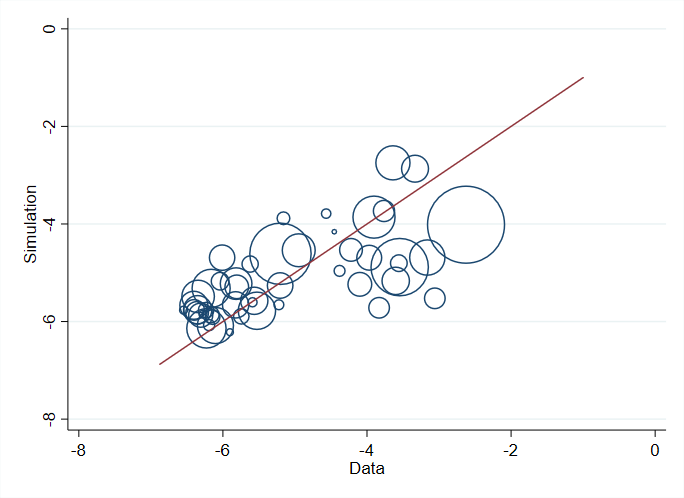

```

Simulated vs actual log installations by state (sized by population)  

.footnote[ [Fit](#estimates-fit)]

---
name: quasi-experimental
# Quasi-Experimental Evidence

### Hughes and Podolefsky, 2015

- Examine the introduction of a solar rebate in California  
- **Results:** $400 to $500 increase in total rebate leads to a .hi-pink[7 to 15%] increase in installations.
- **Model:** $500 increase in subsidies leads to a .hi-pink[6%] increase in installations.  

--

### Crago and Chernyakhovskiy, 2017  

- County-level panel data from 12 states in the US Northeast  
- **Results:** Increasing rebates by $1 per watt increases solar panel installations by .hi-green[47%].  
- **Model:** increasing rebates by $1 per watt in these same 12 states increases installations by .hi-green[51%].  


.footnote[ [Fit](#estimates-fit)]

---
name: decomposition
# Decomposition 

|  | SD Installs |
|:--|:-:|
| Baseline | 1 |
| Harmonize Subsidies | 0.48 |
| Harmonize Electricity Prices | 0.25 |
| Harmonize Installation Prices | 0.23 |
| Equalize Sunlight | 0.09 |
| Harmonize Demographics | 0.08 |


 Standard Deviation in Installation Rates Across States: Decomposition. All are relative to baseline.

.footnote[ [Fit](#estimates-fit)]

---
name: ic-hour-season-fit
# Electricity Production Fit  

```{r ic-hour-fit, out.width = "90%", echo = FALSE}

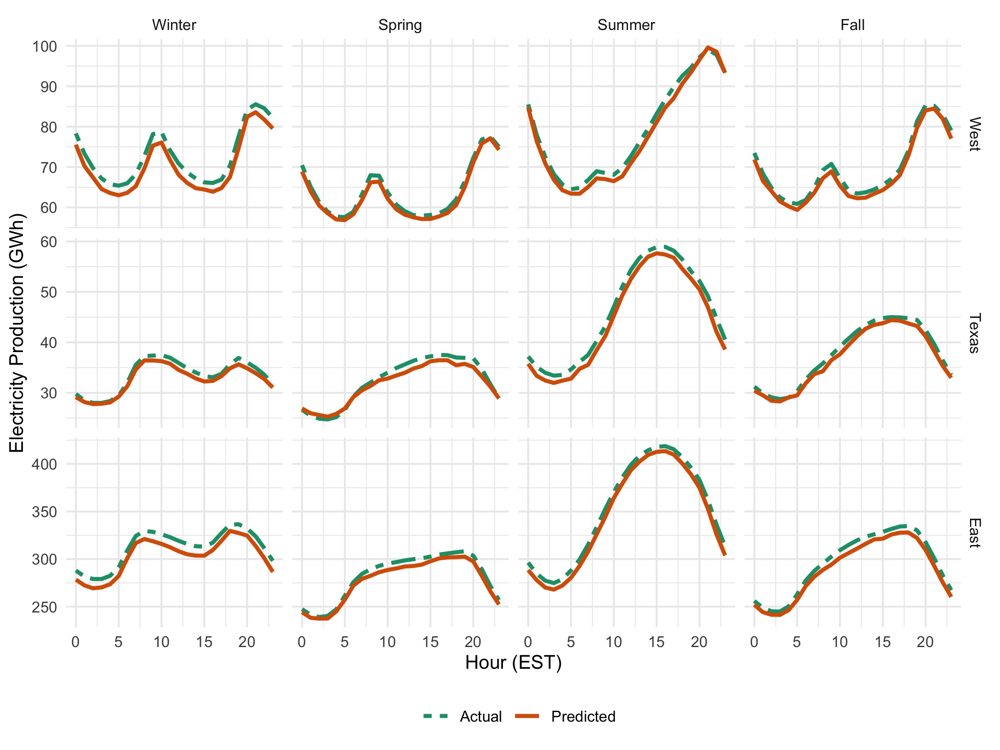

```

.footnote[ [Fit](#estimates-fit)]

---
name: marginal-damages 
# Marginal Damage of electricity 

```{r md, out.width = "100%", echo = FALSE}

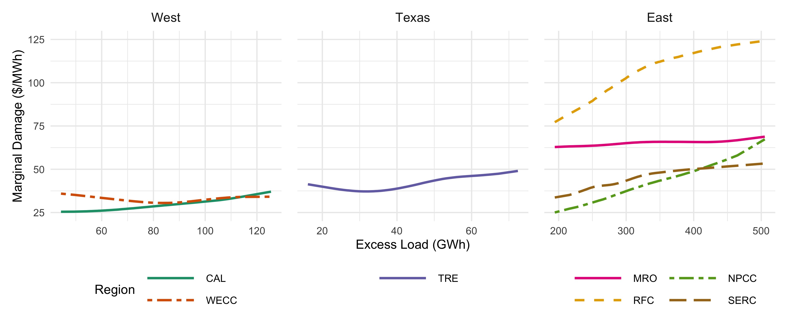

```

Estimated marginal damage of electricity produced in each region over different levels of demand in each interconnection.  

.footnote[ [Fit](#estimates-fit)]

---
name: fuel-mix 
# Fuel mix  

```{r fuelmix, out.width = "100%", echo = FALSE}

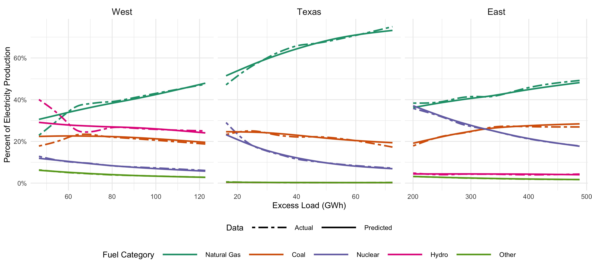

```


.footnote[ [Fit](#estimates-fit)]


---
class: inverse, middle
name:results-appendix
# Results Appendix

.footnote[.smallest[[Results Summary](#results-summary)]]

---
# Marginal subsidy increases     


```{r margsub, out.width = "80%", echo = FALSE}

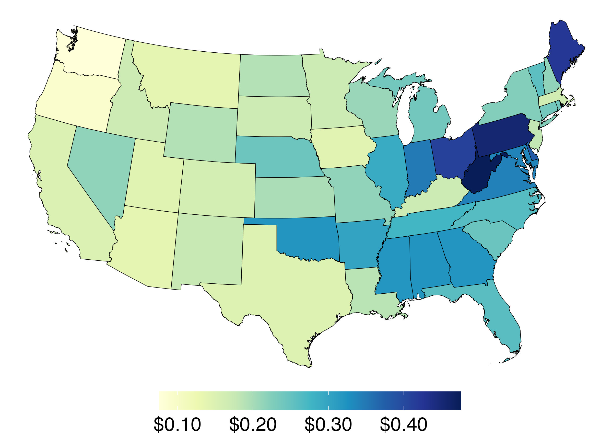

```

<center>Damages offset by a one dollar increase in subsidies</center>


---
# Damage minimizing subsidies  

```{r damage_min_sub, out.width = "80%", echo = FALSE}

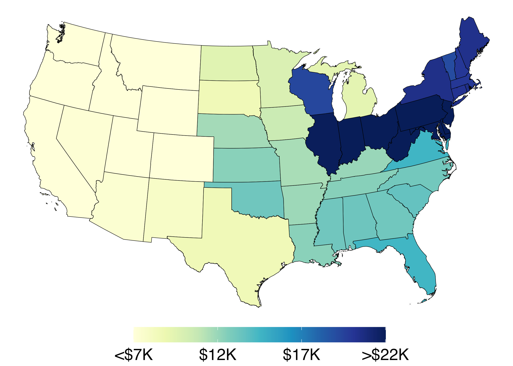

```

<center>Damage Minimizing Subsidies</center>

---
# Damage min spatial misallocation


```{r optrelbase_damage_min, out.width = "80%", echo = FALSE}

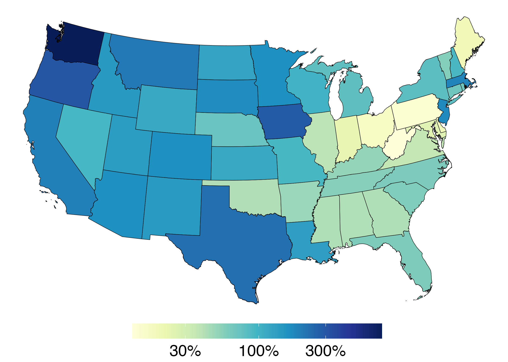

```

<center>Baseline installations as a percent of damage minimizing installations</center>

---
# Total damages offset (Millions of $)  

```{r subs}

subs_dt = data.table(
  row = c('baseline','wm_state','dm_state','wm_tract','dm_tract'),
  match_order = c(1,2,4,3,5),
  Midwest = c(11.3, 16.7, 17.1, 16.7, 17.0),
  Northeast = c(18.2, 18.6, 21.8, 18.6, 21.6),
  South = c(10.4, 15.0, 12.8, 15.1, 12.7),
  West = c(12.0, 12.4, 5.7, 12.4, 5.6),
  Midwest = c(4.1, 6.9, 8.6, 6.9, 8.9),
  Northeast = c(29.8, 20.2, 28.5, 20.2, 27.9),
  South = c(6.8, 11.1, 9.6, 11.1, 9.6),
  West = c(13.2, 14.0, 6.7, 13.9, 6.6),
  National = c(11.4, 12.4, 11.4, 12.4, 11.3),
  CO2e = c(69.8, 75.9, 72.6, 75.9, 72.5),
  NOx = c(18.0, 19.3, 18.3, 19.3, 18.2),
  PM2.5 = c(16.7, 16.9, 18.1, 16.9, 18.1),
  SO2 = c(37.0, 38.3, 48.5, 38.8, 49.4),
  Total = c(141.5, 150.5, 157.5, 150.9, 158.2)
)

subs_dt[order(match_order),12:16] |>
  t() |>
  kbl(align = 'cccccc') |>
  add_header_above(c('','Baseline','State','Tract','State', 'Tract')) |>
  add_header_above(c(' '=2, 'Welfare Maximizing' = 2, 'Damage Minimizing' = 2)) |>
  row_spec(5, bold = TRUE)
  #row_spec(1, color =  red_pink) |>
  #column_spec(c(4,6), color = red_pink)

```

---
count: false 
# Total damages offset (Millions of $)  

```{r subs1}

subs_dt = data.table(
  row = c('baseline','wm_state','dm_state','wm_tract','dm_tract'),
  match_order = c(1,2,4,3,5),
  Midwest = c(11.3, 16.7, 17.1, 16.7, 17.0),
  Northeast = c(18.2, 18.6, 21.8, 18.6, 21.6),
  South = c(10.4, 15.0, 12.8, 15.1, 12.7),
  West = c(12.0, 12.4, 5.7, 12.4, 5.6),
  Midwest = c(4.1, 6.9, 8.6, 6.9, 8.9),
  Northeast = c(29.8, 20.2, 28.5, 20.2, 27.9),
  South = c(6.8, 11.1, 9.6, 11.1, 9.6),
  West = c(13.2, 14.0, 6.7, 13.9, 6.6),
  National = c(11.4, 12.4, 11.4, 12.4, 11.3),
  CO2e = c(69.8, 75.9, 72.6, 75.9, 72.5),
  NOx = c(18.0, 19.3, 18.3, 19.3, 18.2),
  PM2.5 = c(16.7, 16.9, 18.1, 16.9, 18.1),
  SO2 = c(37.0, 38.3, 48.5, 38.8, 49.4),
  Total = c(141.5, 150.5, 157.5, 150.9, 158.2)
)

subs_dt[order(match_order),12:16] |>
  t() |>
  kbl(align = 'cccccc') |>
  add_header_above(c('','Baseline','State','Tract','State', 'Tract')) |>
  add_header_above(c(' '=2, 'Welfare Maximizing' = 2, 'Damage Minimizing' = 2)) |>
  row_spec(5, bold = TRUE) |>
  row_spec(1, color =  red_pink) 
  #column_spec(c(4,6), color = red_pink)

```

- Most of the offset damages are from $\color{#EC7662}{CO_2}$ .hi-pink[emissions]  


---
count: false 
# Total damages offset (Millions of $)  

```{r subs2}

subs_dt = data.table(
  row = c('baseline','wm_state','dm_state','wm_tract','dm_tract'),
  match_order = c(1,2,4,3,5),
  Midwest = c(11.3, 16.7, 17.1, 16.7, 17.0),
  Northeast = c(18.2, 18.6, 21.8, 18.6, 21.6),
  South = c(10.4, 15.0, 12.8, 15.1, 12.7),
  West = c(12.0, 12.4, 5.7, 12.4, 5.6),
  Midwest = c(4.1, 6.9, 8.6, 6.9, 8.9),
  Northeast = c(29.8, 20.2, 28.5, 20.2, 27.9),
  South = c(6.8, 11.1, 9.6, 11.1, 9.6),
  West = c(13.2, 14.0, 6.7, 13.9, 6.6),
  National = c(11.4, 12.4, 11.4, 12.4, 11.3),
  CO2e = c(69.8, 75.9, 72.6, 75.9, 72.5),
  NOx = c(18.0, 19.3, 18.3, 19.3, 18.2),
  PM2.5 = c(16.7, 16.9, 18.1, 16.9, 18.1),
  SO2 = c(37.0, 38.3, 48.5, 38.8, 49.4),
  Total = c(141.5, 150.5, 157.5, 150.9, 158.2)
)

subs_dt[order(match_order),12:16] |>
  t() |>
  kbl(align = 'cccccc') |>
  add_header_above(c('','Baseline','State','Tract','State', 'Tract')) |>
  add_header_above(c(' '=2, 'Welfare Maximizing' = 2, 'Damage Minimizing' = 2)) |>
  row_spec(5, bold = TRUE) |>
  #row_spec(1, color =  red_pink) |>
  column_spec(c(4,6), color = red_pink)

```

- Most of the offset damages are from $CO_2$ emissions  
- .hi-pink[Tract-level] subsidies only slightly better than state-level subsidies  


---
# Subsidy types 

#### Optimal choice involves almost entirely KWh subsidies rather than current dependence on cost based subsidies

<br>

<center>Percent of Subsidy Dollars</center>
```{r sub_type, echo = FALSE}

results = data.table(
  ` ` = c('Unit Subsidies','Cost Subsidies','KWh Subsides', 'Total'),
  Baseline = c(6.8, 81.6, 8.1, 100),
  `Welfare Max` = c(0.3, 0.9, 98.8, 100)
  #,`Damage Min` = c(0.4, 0.9, 98.7, 100)
)

results |>
  kbl() |>
  #kable_classic(
  #  #bootstrap_options = c("striped", "hover"),
  #  full_width = FALSE
  #) |>
  #add_header_above(
  #  c(' ' = 2, 'State Specific Subsidies' = 2)
  #) |>
  row_spec(4, bold = TRUE)


```

???

Percent of subsidy dollars from each subsidy type.  Average PDV of each subsidy type for 15 panel. Population-weighted over all tracts.


---
exclude: true
```{R generate pdfs, include = F, eval = T}
#remotes::install_github('rstudio/pagedown')
library(pagedown)
pagedown::chrome_print("saulnier-tweeds.html", output = "saulnier-tweeds.pdf")
```