```{r setup, include=FALSE}
knitr::opts_chunk$set(
  echo = FALSE, 
  cache = TRUE, 
  fig.align='center',
  warning = FALSE
)

pacman::p_load(
  tidyverse, shiny, magrittr,latex2exp, here, data.table
)

```


# Differential ability to adapt 

.hi-pink[Disadvantaged households] are less able to adapt to **climate change**   
--

- **Energy Justice** literature shows black HH's spend more on energy relative to observably similar white HH's

<center>**Conditional Black-White Energy Expenditure Gap**</center> 
```{r out.width='65%'}
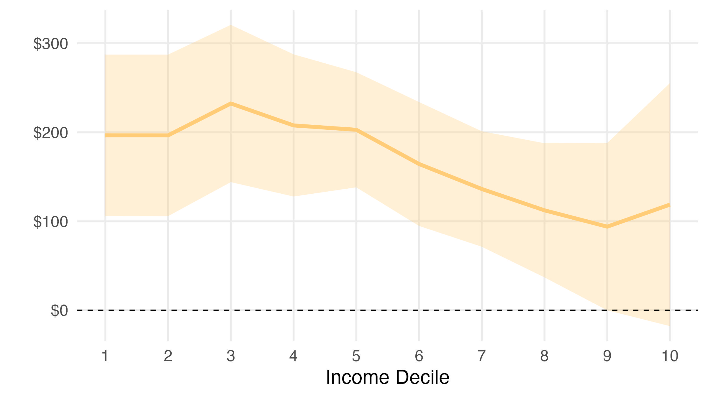
```

--

- Additionally, low-income HH's have **larger barriers to migration**    


???

.footnote[e.g. Reames 2016, Lyubich 2020, Carley and Konisky 2020, Morehouse 2022.]

---
# Disadvantaged HH's are more exposed  

<center>.bold[Change in .hi-pink[hot] days, 1990 to 2019]</center> 

.pull-left[
```{r, out.width = "100%"}

knitr::include_graphics(
  path = "figs-climate/climate/prism-grid-hot-days-1990-2019.jpeg"
)

```
]

.pull-right[
```{r, out.width = "100%"}

knitr::include_graphics(
  path = "figs-climate/climate-change-vs-1990/perc-nonwhite-hot.jpeg"
)

```
]

???

.footnote[
- A .hi-pink[hot] day is average temp is above 90th percentile (~80F)
- Differences taken between 5-year moving averages in 1990 and 2019 
]

---
# Disadvantaged HH's are more exposed  

<center>.bold[Change in .hi-pink[hot] days, 1990 to 2019]</center> 

.pull-left[
```{r, out.width = "100%"}

knitr::include_graphics(
  path = "figs-climate/climate/prism-grid-hot-days-1990-2019.jpeg"
)

```
]

.pull-right[
```{r, out.width = "100%"}

knitr::include_graphics(
  path = "figs-climate/climate-change-vs-1990/perc-nonwhite-hot.jpeg"
)

```
]

<br> 

**Q: What are equity implications of climate change given differential ability to adapt and differential exposure?**  

???

.footnote[
- A .hi-pink[hot] day is average temp is above 90th percentile (~80F)
- Differences taken between 5-year moving averages in 1990 and 2019 
]

---
# What we are going to do...

1. Create a .hi-pink[spatial equilibrium model] of US labor markets  

  - Heterogeneous HH's choose **where to live** and **energy consumption**  
  - Climate impacts energy demand and city's amenity value  
  
--

2. Structurally .hi-pink[estimate the model]     

  - Household data from the census and ACS  
  - Historical climate data from PRISM  

--

3. Simulate .hi-pink[counterfactual climate] scenarios  

  - To-date, climate damages are **3x larger** for black vs white HH's  
  - Black-white gap will **continue to grow** under emissions projections   

---
class: inverse, middle

# Model Overview 
.footnote[.white[(without equations!)]]


---
# Main ingredients  


Households choose .hi-pink[where to live] based on...  
- Wages they could earn  
- Rent they would have to pay  
- Local amenities---includes both climate and non-climate factors   
- Moving costs 

--

Conditional on location, they choose .hi-pink[electricity, gas, and housing demand]  
- They use housing, electricity, and gas to produce **comfort**    
- The comfort production function is **affected by climate**
- Allow for heterogeneity in comfort production technology across demographic groups  

--

Wages and rents **endogenously adjust** based on a city's population.  


---
# Key intuition  

### Suppose there are more hot days in the South... 

--

- **Amenities in the South decrease** relative to other locations  
- **More costly to produce comfort** as HH's use A/C more intensely     

--

$\implies$ conditional on living in the South, utility has decreased.  

--

- Some households **migrate**, equilibrium wages and rents adjust    

--

### Three mechanisms causing .pink[unequal distribution]  

For minority and low-income HH's...

1. **Comfort costs are higher**, use larger share of income for energy  
--

1. **Moving costs are higher**, more difficult migrate to mitigate welfare loss  
--

1. **Greater exposure to climate change** based on *ex-ante* location


---
class: inverse, middle

# Data and Estimation  


---
# Data and Estimation 


### We structurally estimate the model using... 

1. **Household Data**: Repeated cross sections of the 1990 and 2000 census and 2010 and 2019 5-year ACS   
2. **Climate Data**: Daily temperature and precipitation on a 4km grid of continental US from PRISM
3. **Energy Prices**: Annual, state average residential electricity and gas prices from the EIA  


???

### Brief estimation overview  

1. **Comfort Production Function**: Estimate parameters of comfort production function using relative electricity, gas, and housing demand.    
2. **Moving Costs and Mean Utilities**: Use maximum likelihood estimation targetting the share of demographic group choosing each city.
3. **Climate Amenities**: Decompose mean utilities with OLS. 


---
# Climate's effect on comfort production   

<center>.bold[Effect of an additional day at temperature]</center> 
<center>.small-it[Relative to a day at 65 degrees]</center>  

.pull-left[

<center>.hi-yellow[for electricity benefit]</center>
```{r, out.width='100%', fig.align='center'}
  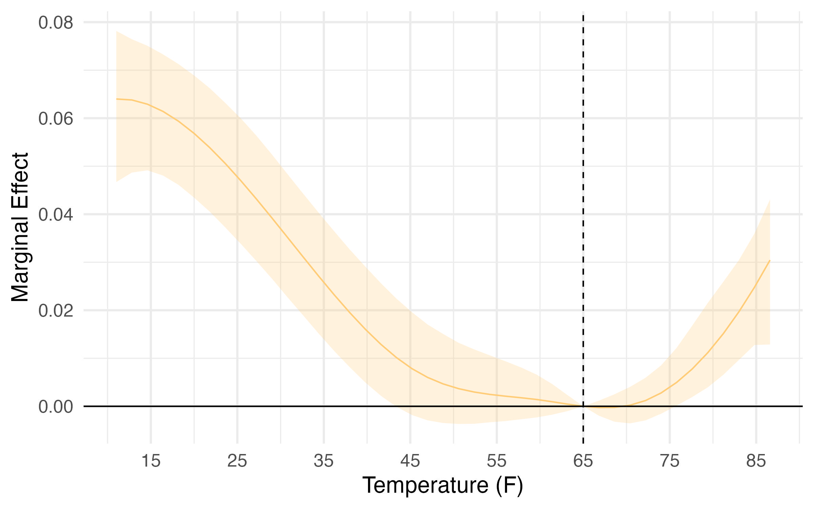
```

]


.pull-right[

<center>.hi-green[for gas benefit]</center>
```{r, out.width='100%', fig.align='center'}
  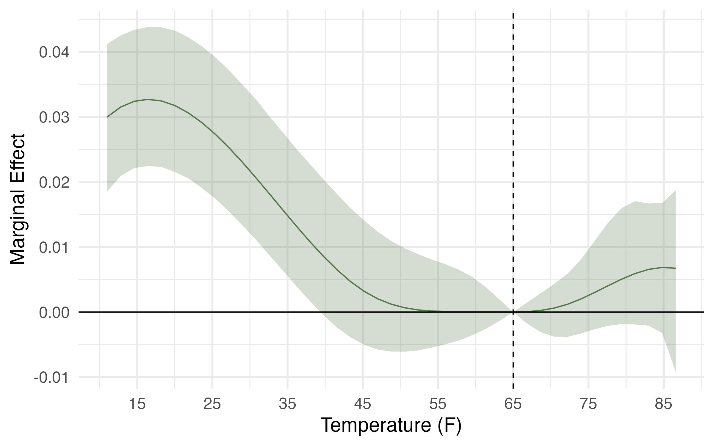
```

]

<br> 

- Identification from random variation in weather    
- Corresponds to marginal benefit of electricity or gas use   

???

CI calculated using a bootstrapping procedure with 10,000 draws, clustered by city-year.


---
# Climate's effect on amenities  


<center>.bold[Effect of an additional day at temperature]</center> 
<center>.small-it[Relative to a day at 65 degrees]</center>  

```{r, out.width='70%', fig.align='center'}
  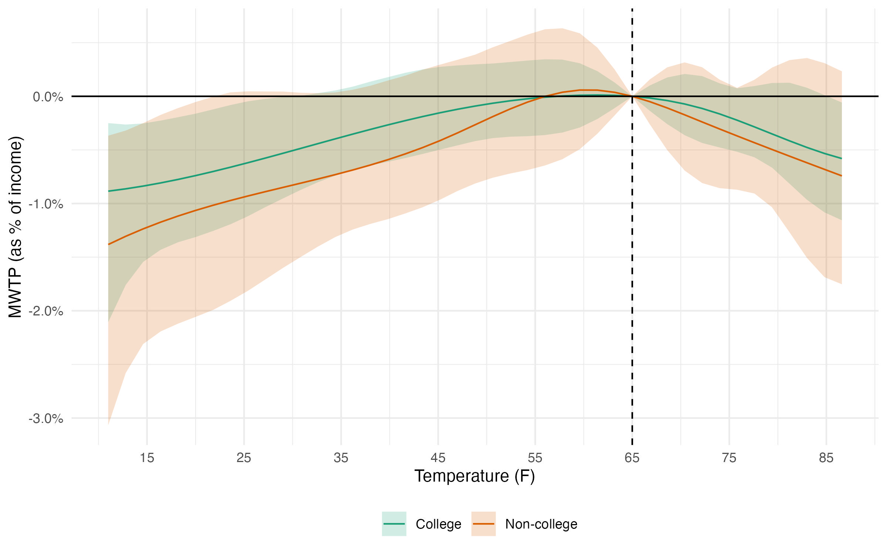
```


???

Estimate $\hat{\delta}_{djt} = \sum_\tau\beta^Z_e(\tau)D_{\tau jt} + \text{FE}_d + \text{FE}_t + \xi_{djt}$ 

.footnote[
  CI calculated using a bootstrapping procedure with 10,000 draws, clustered by city and year. 
]


---
class: inverse, middle

# Results  


---
# Effect of climate change to-date

### Compare present day climate with that of 1990

```{r out.width='60%', fig.align='center'}
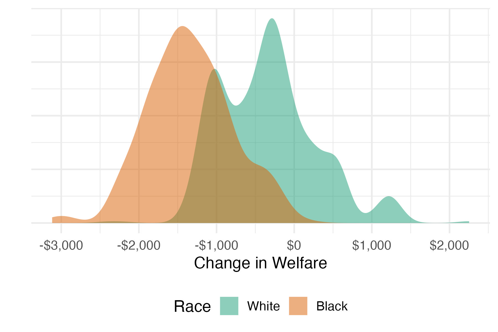
```

- Welfare loss for median black HH **3x larger** than median white HH  
- This amounts to damages of $1,200 vs $400 (or 3% vs 1% of income) 


---
# Spatial variation 

<center>**Compensating Variation**</center>
```{r out.width='80%', fig.align='center'}
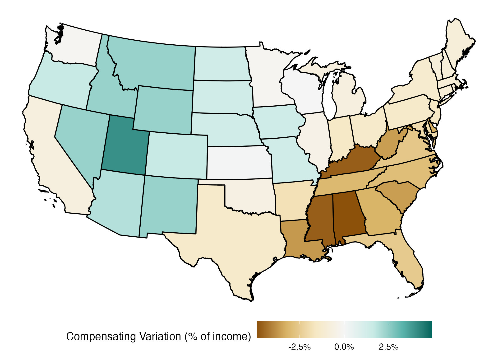
```


---
# Black-white gap grows with emissions  

The **difference in welfare effects** of climate change between black and white HH's grows under future emissions scenarios. 

```{r out.width='100%', fig.align='center'}
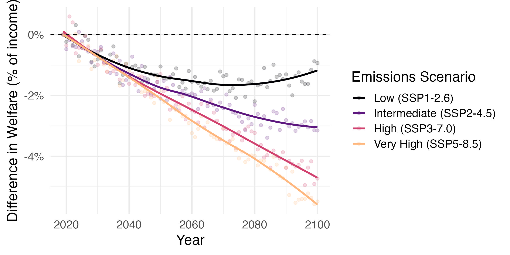
```


---
# Conclusions and next steps 

### Black HH have faced 3x larger climate damages to-date   

- Ability to migrate reduces gap by 33% for white HH, only 14% for black  
- Controlling for initial location reduces the gap by 25% 

--

### Next Steps

- What policies would be effective at .hi-pink[reducing the observed inequalities] in the impact of climate change?  
- Account for natural disaster risk and other extreme weather events  
- Endogenize electricity and gas prices to climate and energy demand  

---
class: inverse, middle

# Thank you    

Emmett Saulnier  
[emmetts@uoregon.edu](mailto:emmetts@uoregon.edu)  
[https://www.emmettsaulnier.com/](https://www.emmettsaulnier.com/) 


---
class: inverse, middle
# Appendix 


---
# Literature  

Contribute to understanding of .hi-pink[spatial heterogeneity] in climate change    
- Hedonic estimates of the amenity value of climate .smallest[(Albouy 2016)]  
- Effect of climate on residential energy use .smallest[(Auffhammer 2022)]  
- Dynamic spatial equilibrium model with adaptation through trade, sectoral switching, and migration .smallest[(Rudik et. al. 2022)]   

Our paper extends this work by focusing on **distributional impacts** and decomposing relative value of different **adaptation mechanisms**. 

--

We build on the .hi-pink[quantitative spatial equilibrium] literature  
- Worker skill sorting and endogenous amenities .smallest[(Diamond 2016)]  
- Moving costs in China .smallest[(Liang, Song, and Timmins 2020)] 
- Emissions and land use restrictions .smallest[(Colas and Morehouse 2022)]    
  

---
class: inverse, middle

# Model Appendix


---
# Household preferences   

Household $i$ of demographic group $d$ living in city $j$ gets utility from a composite $X$, "comfort at dwelling" $\mathcal{C}$, and location-specific amenities $\mathbb{A}$. 

$$U_{ij} = X^{\alpha_d^X} \mathcal{C}_{dj}^{\alpha_d^c}\exp(\mathbb{A}_{ij})$$  
--

**Amenities** are affected by .hi-yellow[climate variables], .hi-green[moving costs], a shared, unobservable component, and an idiosyncratic taste shock

$$\mathbb{A}_{ij} = \color{#FFCC77}{\alpha^Z_d \cdot Z_{j}} +\color{#57754D}{g(j,\boldsymbol{b}_i)}+ \xi_{dj}  + \sigma_d\varepsilon_{ij}.$$


---
# Household comfort

Households produce .hi-blue[comfort] using .hi-purple[energy] $\color{#9370DB}{\mathcal{E}}$ and housing $H$ 

$$\color{#4682B4}{\mathcal{C}(H,\mathcal{E}|d,j)} = \left(\theta^H_{dj}H^{\rho_c} + \theta^\mathcal{E}_{dj}\color{#9370DB}{\mathcal{E}}^{\rho_c} \right)^{1/\rho_c}$$

--
.hi-purple[Energy] $\color{#9370DB}{\mathcal{E}}$ aggregates .hi-yellow[electricity] $\color{#FFCC77}{E}$ and .hi-green[natural gas] $\color{#57754D}{G}$.
 
$$\color{#9370DB}{\mathcal{E}(E,G|d,j)} = \left(\theta^E_{dj} \color{#FFCC77}{E}^{\rho_\mathcal{E}} + \theta^G_{dj}\color{#57754D}{G}^{\rho_\mathcal{E}} \right)^{1/\rho_\mathcal{E}}$$
--

**Climate impacts the production of .hi-blue[comfort]** through $\theta^m_{dj}$, where $\theta^m_{dj} = f_m(Z_j)$ for $m \in \{E,G\}$, where $Z_j$ is a vector of climate variables in city $j$. 


---
name: energy-cost-min
# Household comfort   

We can simplify the household's problem by .hi-pink[solving two, nested cost-minimization problems]. First for the production of energy using electricity and gas .smallest[[[details]](#energy-cost-min-details)]

$$\min_{E,G} P^E_jE + P^G_jG \quad \text{s.t.} \quad \bar{\mathcal{E}} = \left(\theta^E_{dj} E^{\rho_\mathcal{E}} + \theta^G_{dj}G^{\rho_\mathcal{E}} \right)^{1/\rho_\mathcal{E}}$$

--

The unit cost function gives the **price of energy**   

$$P^\mathcal{E}_{dj} = \left({\theta^E_{dj}}^{\sigma_\mathcal{E}}{P^E_j}^{1-\sigma_\mathcal{E}} + {\theta^G_{dj}}^{\sigma_\mathcal{E}}{P^G_j}^{1-\sigma_\mathcal{E}}\right)^{\frac{1}{1-\sigma_\mathcal{E}}}$$

Where $\sigma_\mathcal{E} = \frac{1}{1-\rho_\mathcal{E}}$ is the elasticity of substitution for electricity and gas.


---
name: energy-cost-min-details
# Cost minimization of energy

$$\min_{E,G} P^E_jE + P^G_jG \quad \text{s.t.} \quad \bar{\mathcal{E}} = \left(\theta^E_{dj} E^{\rho_\mathcal{E}} + \theta^G_{dj}G^{\rho_\mathcal{E}} \right)^{1/\rho_\mathcal{E}}$$

--

The first-order conditions give us the following conditional demand functions for electricity $E^*$ and natural gas $G^*$, 

$$E^*(\mathcal{E}| d, j) = M^\mathcal{E}_{dj}\left(P^G_{dj}\theta^E_{dj}\right)^{\sigma_\mathcal{E}} \mathcal{E} \qquad
    G^*(\mathcal{E}| d, j) = M^\mathcal{E}_{dj}\left(P^E_j\theta^G_{dj}\right)^{\sigma_\mathcal{E}} \mathcal{E}$$

where $M^\mathcal{E}_{dj} = \left( {\theta^E_{dj}}^{\sigma_\mathcal{E}}{P^G_{dj}}^{\sigma_\mathcal{E}-1} + {\theta^G_{dj}}^{\sigma_\mathcal{E}}{P^E_{dj}}^{\sigma_\mathcal{E}-1}\right)^{\frac{\sigma_\mathcal{E}}{1-\sigma_\mathcal{E}}}$.  

--

  The unit cost function gives the "price of energy"   

$$P^\mathcal{E}_{dj} = \left({\theta^E_{dj}}^{\sigma_\mathcal{E}}{P^E_j}^{1-\sigma_\mathcal{E}} + {\theta^G_{dj}}^{\sigma_\mathcal{E}}{P^G_j}^{1-\sigma_\mathcal{E}}\right)^{\frac{1}{1-\sigma_\mathcal{E}}}$$
which we can then use to solve the outer nest, $\mathcal{C}$. .smallest[[[return]](#energy-cost-min)]

---
name: comfort-cost-min
# Household comfort
We can then solve the outer cost minimization problem to get the price of comfort .smallest[[[details]](#comfort-cost-min-details)]

$$\min_{\mathcal{E},H} P^\mathcal{E}_j\mathcal{E} + P^H_jH \quad \text{s.t.} \quad \bar{\mathcal{C}} = \left(\theta^H_{dj}H_{dj}^{\rho_c} + \theta^\mathcal{E}_{dj}\mathcal{E}_{dj}^{\rho_c}\right)^{1/\rho_c}$$
--

The unit cost function gives the **price of comfort**

$$P^\mathcal{C}_{dj} = \left({\theta^H_{dj}}^{\sigma_c} {P^H_{dj}}^{1-\sigma_c}+ {\theta^\mathcal{E}_{dj}}^{\sigma_c}{P^\mathcal{E}_{dj}}^{1-\sigma_c}\right)^{\frac{1}{1-\sigma_c}}$$
Where $\sigma_c = \frac{1}{1-\rho_c}$ is the elasticity of substitution for housing and energy.


--

Once we have $P^\mathcal{C}_{dj}$, we can solve the model like a typical Cobb-Douglas.   


---
name: comfort-cost-min-details
# Cost minimization of comfort

$$\min_{\mathcal{E},H} P^\mathcal{E}_j\mathcal{E} + P^H_jH \quad \text{s.t.} \quad \bar{\mathcal{C}} = \left(H_{dj}^{\rho_c} + \theta^\mathcal{E}_{dj}\mathcal{E}_{dj}^{\rho_c}\right)^{1/\rho_c}$$

--

The first-order conditions give us the following conditional demand functions for energy $\mathcal{E}^*$ and housing $H^*$, 

$$H^*(C| d, j) = M^c_{dj}\left(P^\mathcal{E}_{dj}\right)^{\sigma_c} \mathcal{C}_{dj} \qquad
\mathcal{E}^*(\mathcal{C}| d, j) = M^c_{dj}\left(P^H_j\theta^\mathcal{E}_{dj}\right)^{\sigma_c} \mathcal{C}_{dj}$$

where $M^c_{dj} = \left({\theta^\mathcal{E}_{dj}}^{\sigma_c}{P^H_{dj}}^{\sigma_c-1} + {P^\mathcal{E}_j}^{\sigma_c-1}\right)^{\frac{\sigma_c}{1-\sigma_c}}$

--

Again, the unit cost function gives the "price of comfort"   


$$P^\mathcal{C}_{dj} = \left({P^H_{dj}}^{1-\sigma_c}+ {\theta^\mathcal{E}_{dj}}^{\sigma_c}{P^\mathcal{E}_{dj}}^{1-\sigma_c}\right)^{\frac{1}{1-\sigma_c}}$$
Once we have $P^c_j$, we can solve the model like a typical Cobb-Douglas. .smallest[[[return]](#comfort-cost-min)]

---
name: labor-supply
# Labor supply  

#### Indirect utility function  
Conditional on choosing city $j$, household $i$ gets indirect utility $V_{ij}$, as

$$\log V_{ij} =\tilde{\alpha}_{d}\log(W_{dj}) - \alpha_d^\mathcal{C} \log(P_{dj}^\mathcal{C}) + \alpha^Z_d \cdot Z_{j} + g(j,\boldsymbol{b}_i) +\xi_{dj}+ \sigma\varepsilon_{ij}.$$
--

- $W_{dj}$ are wages for demographic group $d$ in city $j$  


--

Households pick the city which gives them the .hi-pink[highest indirect utility]  

.smallest[[[details]](#labor-supply-details)]


---
name: labor-supply-details
# Labor Supply  

#### City choice probabilities  
Assuming $\varepsilon$ are type 1 extreme value, we get city choice probabilities as  

$$P_{ij} = \frac{\exp{(\tilde{V}_{ij})}}{\sum_j\exp(\tilde{V}_{ij})} \quad \text{where} \quad  \tilde{V}_{ij} = (V_{ij} - \varepsilon_{ij})/\sigma_d$$

#### Demand functions  

\begin{align}
    H^*_{dj} &= M^c_{dj} \left(P^E_{dj}\right)^{\frac{1}{1-\rho_c}}\times\frac{\alpha_d^\mathcal{C}  W_{dj}}{\tilde{\alpha}_{d}}\\
    E^{e*}_{dj} &= M^c_{dj}\left(P_j^h\theta^\mathcal{E}_{dj}\right)^{\frac{1}{1-\rho_c}} 
    M^E_{dj}\left(P^g_j\theta^g_{dj}\right)^{\frac{1}{1-\rho_E}} 
    \times\frac{\alpha_d^\mathcal{C}  W_{dj}}{\tilde{\alpha}_{d}}\\
    E^{g*}_{dj} &= M^c_{dj}\left(P_j^h\theta^\mathcal{E}_{dj}\right)^{\frac{1}{1-\rho_c}} 
    M^E_{dj}\left(P^e_j\theta^e_{dj}\right)^{\frac{1}{1-\rho_E}} 
    \times\frac{\alpha_d^\mathcal{C}  W_{dj}}{\tilde{\alpha}_{d}}.
\end{align}

.smallest[[[return]](#labor-supply)]

---
# Housing supply  

Each city is characterized by a long-run, upward sloping rental supply curve,

$$\log(P^H_j) = a_j + \zeta_j\log(H_j)$$
- $a_j$ captures variation in construction costs   
- $\zeta_j$ is the inverse housing supply elasticity, reflecting variation in the amount of land available for development and land-use restrictions  
- $H_j$ is aggregate housing demand in city $j$   

---
name: firms
# Firms  

Firms producing the output good $Y$ using labor $\mathcal{L}$ with capital $K$ in perfectly competitive markets    

--

\begin{align}
    Y_{j} = B_jK_j^{\alpha}\mathcal{L}_j^{1-\alpha}.
\end{align}

 - $B_j$ is city-specific total factor productivity 
 - $\mathcal{L}_j$ is a CES aggregator between college $S$ and non-college $L$ educated labor  

$$\mathcal{L}_j = \left(\lambda_jS_j^{\rho_l} + (1-\lambda_j)L_j^{\rho_l}\right)^{\frac{1}{\rho_l}}$$

--

We can solve the firm's profit maximization problem to derive labor demand curves .smallest[[[details]](#firms-details)] 

---
class: inverse, middle

# Data and Estimation Appendix

---
name: household-data
# Household data  

We use the 1990 and 2000 census, along with the 2010 and 2019 5-year ACS, for household location, demographics, income, energy and housing expenditure.  

--

### Market level indices  
We construct indices for rent, wages, and energy.   

  - **Rent**: We decompose housing expenditure into rent and housing quantity by regressing housing expenditure on a city-year fixed effect and house characteristics .smallest[[[details]](#housing-indices-details)]  
--

  - **Wages**: We perform a similar process for wages, additionally adjusting for unemployment .smallest[[[details]](#wage-indices-details)]  
--

  - **Energy**: We divide energy expenditure by state level prices from the EIA, then control for observable characteristics .smallest[[[details]](#energy-indices-details)]  

---
name: housing-indices-details
# Housing and Rent  

We decompose gross housing expenditure $\mathbb{E}^H_{ijt}$ into quantity $H$ and price $P^H_{jt}$ by regressing log expenditure on a city-year fixed effect and a vector of observable characteristics about the house, $X_{ijt}$

$$\log(\mathbb{E}^H_{ijt}) = \mu_{jt} + X^\prime_{ijt} \beta_t   + \varepsilon_{ijt}$$
Rent is $P^H_{jt} = e^{\mu_{jt}}$ and housing quantity is $H_{ijt} = \mathbb{E}^H_{ijt}/P^H_{jt}$.

.smallest[[[return]](#household-data)]


---
name: climate-data
# Climate data 

### PRISM historical climate data  
- Average daily temperature and total precipitation for the continental US on a 4km grid from 1981 to 2019  
- Take population weighted averages of grid cells within each CBSA
- Calculate annual and 5-year moving average measures of climate 
  - Number of days in temperature bins 
  - Average and standard deviation of daily temperature 
  - Total rainfall and rainy days 
  - Summer and winter temperatures (max and min monthly average)


.footnote[[[details]](#prism-data-details)]

---
# Estimation overview 

There are a lot of things, today we'll focus on .hi-pink[estimation of comfort]  

--

1. **Comfort parameters** *(Price of comfort)*: Relative demand functions   
2. **Labor supply** *(Moving costs, climate amenities)*: Two-step BLP    
3. **Labor demand** *(College and non-college wages)*: Calibrated .smallest[(Card 2010)]   
4. **Housing supply** *(Elasticity of housing supply, city intercepts)*: Elasticities calibrated, then back out the intercepts .smallest[(Saiz 2010)] 


---
# Estimation strategy for $\mathcal{E}$  

The relative demand function from the cost-minimization problem give us  

$$\log\left({\frac{E_{djt}}{G_{djt}}}\right) = \sigma_\mathcal{E} \log\left({\frac{\theta^E_{djt}}{\theta^G_{djt}}}\right)+ \sigma_\mathcal{E}\log\left(\frac{P^G_{jt}}{P^E_{jt}}\right)$$

--

Taking first differences yields our estimating equation:

$$\Delta \log\left({\frac{E_{djt}}{G_{djt}}}\right) = \sigma_\mathcal{E}\Delta \log\left(\frac{P^G_{jt}}{P^E_{jt}}\right) + \Delta u_{djt}$$  

--

- Concerned with endogeneity between prices and quantity demanded
- Instrument for price ratio with lagged commercial elec and gas prices to isolate shocks to supply .smallest[(working on better instruments)]

--

Use $\hat{\sigma_\mathcal{E}}$ and residuals to calculate $\mathcal{E}$ and $P_\mathcal{E}$


---
# Estimation strategy for $\mathcal{C}$  

The relative demand function from the cost-minimization problem give us  

$$\log\left({\frac{\mathcal{E}_{djt}}{H_{djt}}}\right) = \sigma_c \log\left({\frac{\theta^\mathcal{E}_{djt}}{\theta^H_{djt}}}\right)+ \sigma_c\log\left(\frac{P^H_{jt}}{P^\mathcal{E}_{jt}}\right)$$

--

Taking first differences yields our estimating equation, 

$$\Delta\log\left({\frac{\mathcal{E}_{djt}}{H_{djt}}}\right) = \sigma_{\mathcal{C}}\Delta\log\left(\frac{P^H_{jt}}{P^\mathcal{E}_{jt}}\right) + \Delta\epsilon_{djt}$$

--

We use a **Bartik instrument interacted with land availability** for $\Delta\log(P^H_{jt}/P^\mathcal{E}_{jt})$, taking care of endogeneity caused by unobserved amenities being correlated with both rent and housing demand.


---
# Effect of climate on comfort production  

We parameterize $\theta$'s using $D_{\tau jt}$, the number of days at temperature $\tau$:  

$$\color{#FFCC77}{\log{\tilde{\theta}^E_{djt}}} = \sum_\tau\kappa_E(\tau)D_{\tau jt} + \nu^E_{djt} \qquad \color{#57754D}{\log{\tilde{\theta}^G_{djt}}} = \sum_\tau\kappa_G(\tau)D_{\tau jt} + \nu^G_{djt}$$


- Using some tricky normalizations and the previous estimation, we have estimates of 
$\log{\tilde{\theta}^G_{djt}}$ and $\log{\tilde{\theta}^E_{djt}}$  
- $\kappa_m(\tau)$ is a cubic B-spline, allowing for flexible, non-linear estimate of the effect of an additional day at temperature $\tau$ on electricity and gas demand   
- Identification comes from random variation in weather, as we include city and demographic  group fixed effects  

---
# Estimating labor supply  

We use two steps to estimate the remaining utility parameters

1. **Use BLP to estimate moving cost parameters and "mean utilities"**  
  - Mean utility, $\delta_{djt}$, captures things that affect utility that are constant within demographic group, city, and year, including wages, the price of comfort, and climate amenities.  
  - Have a likelihood function for household choosing each city  
  - Estimate $\delta_{djt}$'s and effect of individual factors using MLE  
--

2. **Decompose the mean utilities to estimate climate amenities**    
  - Calibrate coefficient on wages using Diamond (2016)  
  - Calibrate coefficient on comfort price using comfort expenditure share (Cobb-Douglas utility)  
  - Estimate effect of climate on the residual deltas, after subtracting portion coming from wages and comfort prices  


---
# Moving cost parameters  


We parameterize the moving cost function as  
$$g(j, \boldsymbol{b}_i) = \gamma_d^{st} \mathbb{I}\left(j \in b^{st}_i\right) + \gamma_d^{\text{dist}} \phi \left(j,b^{st}_i\right) + \gamma_d^{\text{dist2}} \phi^2\left(j,b^{st}_i\right)$$

--

We find that college HH's have lower moving costs than non-college   
- Non-college get a higher birth-state premium  
- Non-college distance from birthplace penalties generally higher  

```{r, out.width='85%', fig.align='center'}
  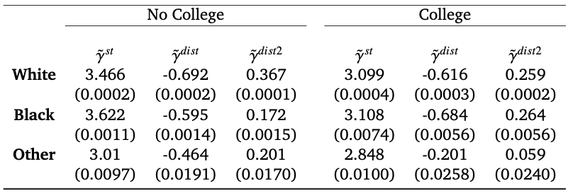
```


---
name:sim-intro
# Simulations   

### CMIP6 climate models 
- Most recent generation of climate models used for the IPCC's AR6 .smallest[[[details]](#cmip6-data-details)]
- Global daily temperature and precipitation (among others) for 1950-2100 under various emissions scenarios  
- We use an ensemble of 26 climate models, downscaled and de-biased by the [Climate Impact Lab](https://planetarycomputer.microsoft.com/dataset/group/cil-gdpcir)  

```{r, out.width = "60%", fig.align='center'}

knitr::include_graphics(
  path = "figs-climate/cil-downscale.png"
)

```

---
name:ge-model-fit 
# GE simulation model fit 

The simulation matches actual data under the baseline (factual) climate 

.pull-left[
<center>**Electricity Demand**</center>
```{r out.width='100%', fig.align='center'}
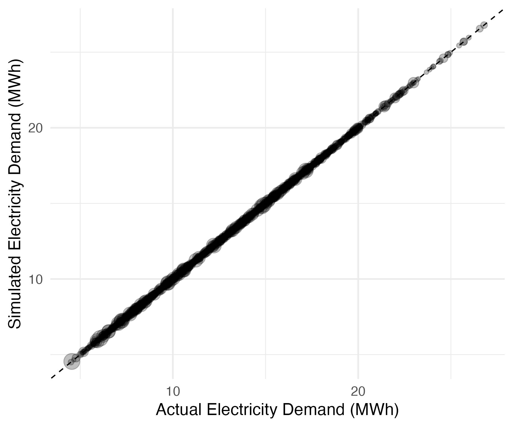
```
]


.pull-right[
<center>**Gas Demand**</center>
```{r out.width='100%', fig.align='center'}
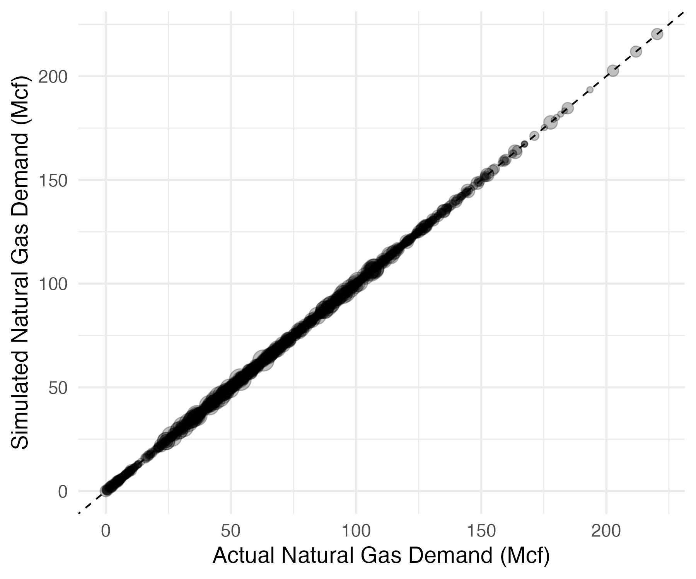
```
]

.footnote[[More model fit plots](#model-fit-appendix)]


---
name: model-fit-appendix
# Model fit 

.pull-left[
<center>**Rent**</center>
```{r out.width='100%', fig.align='center'}
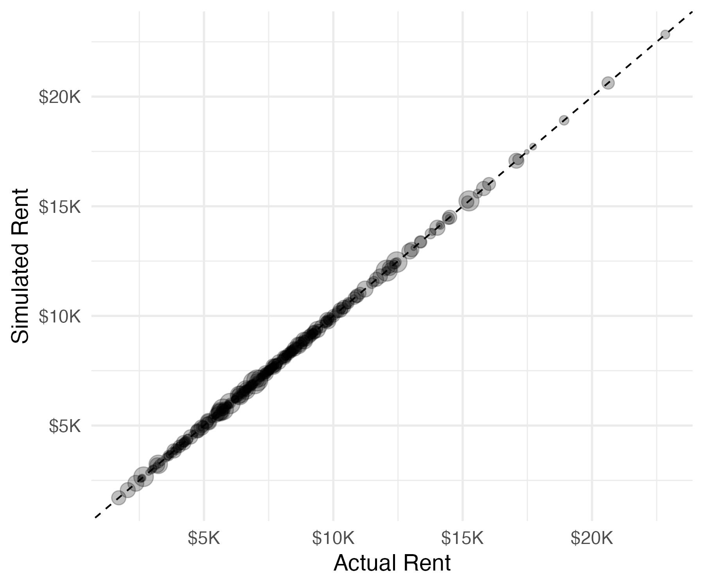
```
]

.pull-right[
<center>**Wages**</center>
```{r out.width='100%', fig.align='center'}
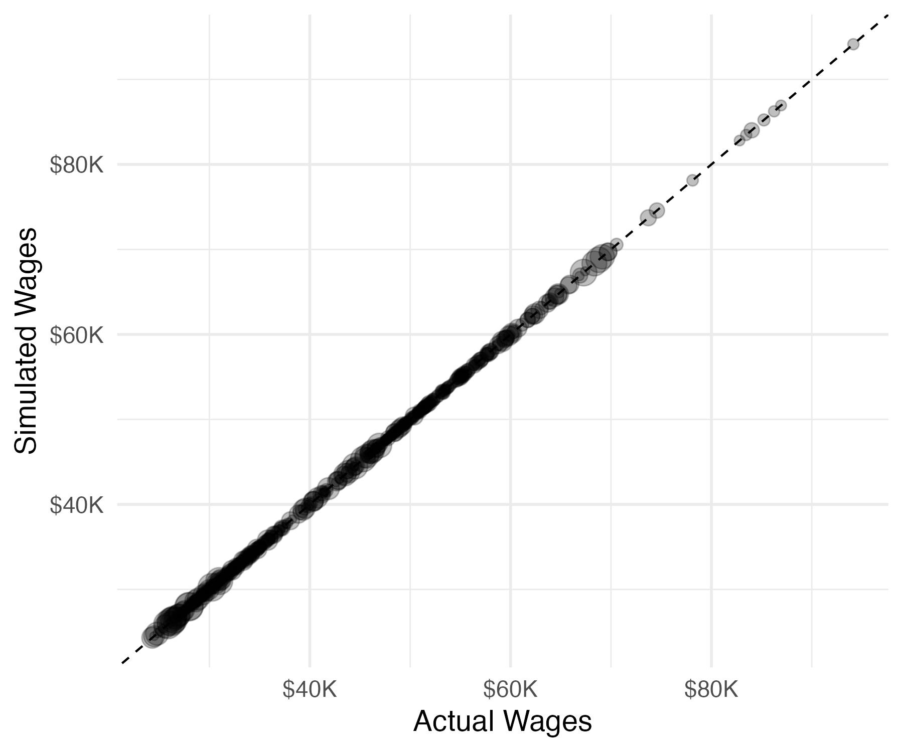
```
]

.footnote[[[return]](#ge-model-fit)]

---
# Model fit 

<center>.bold[Population Shares]</center>

```{r out.width='65%', fig.align='center'}
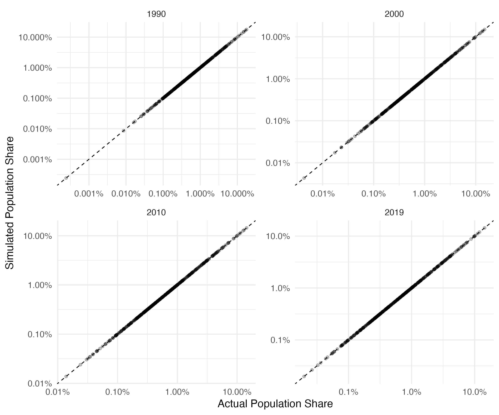
```


.footnote[[[return]](#ge-model-fit)]

---
# Spatial variation 


<center>**Energy Price**</center>
```{r out.width='80%', fig.align='center'}
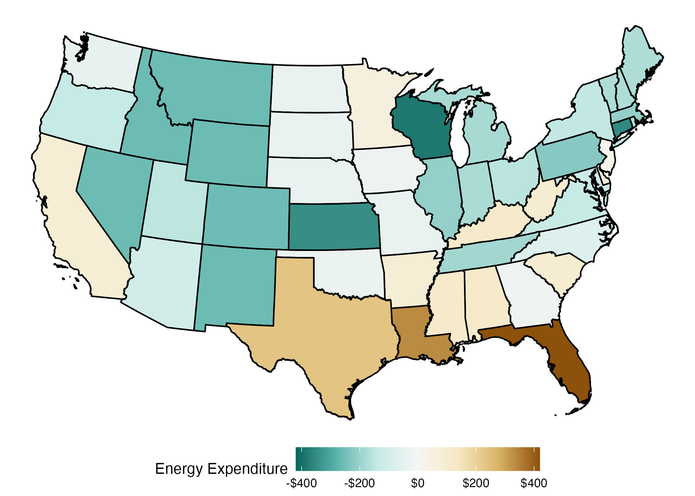
```

Different effects of warming in hot vs cold states  


---
# Migration reduces welfare loss  

We **fix locations** and take the difference between that and GE welfare.  

```{r out.width='60%', fig.align='center'}
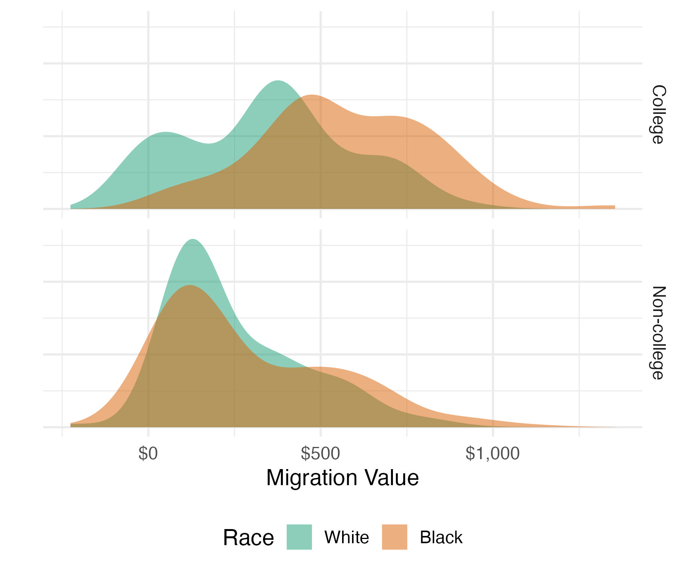
```

Migration reduces welfare loss by **34%** for white and **14%** for black HHs.  


---
exclude: true

```{R generate pdfs, include = F, eval = F}
#remotes::install_github('rstudio/pagedown')
library(pagedown)
pagedown::chrome_print(
  here("presentations/saulnier-weai/saulnier-weai-2023.html"),
  output = here("presentations/saulnier-weai/saulnier-weai-2023.pdf")
)
```