```{css echo=FALSE}
.pull-left-60 {
  float: left;
  width: 60%;
}
.pull-right-40 {
  float: right;
  width: 40%;
}
```

```{r setup, include=FALSE}
knitr::opts_chunk$set(
  echo = FALSE, 
  fig.align = 'center', 
  warning = FALSE, 
  message = FALSE,
  cache = TRUE,
  cache.lazy = FALSE
)

pacman::p_load(
  here, magrittr, modelsummary, kableExtra, fixest, tibble, 
  fst, dplyr, data.table, collapse, tidyr, ggplot2, stringr,
  hrbrthemes, knitr, qs, patchwork
)

here::i_am("presentations/saulnier-weai/saulnier-weai.Rmd")

#comb_dt = read.fst(here("data-clean/comb_dt.fst"), as.data.table = T) 
comb_dt = read.fst(here("data-clean/comb-cnty-health-dt.fst"), as.data.table = T) 

soy_counties = 
  comb_dt[,
    .(tot_soy = sum(soy_acres, na.rm =T)), by = GEOID
  ][tot_soy>0, GEOID]

# Normalize the variables we care about 
norm = function(x){(x-mean(x,na.rm = TRUE))/sd(x, na.rm = TRUE)}
glyph_cols = str_subset(colnames(comb_dt), "glyph")

comb_dt[,
  (glyph_cols) := lapply(.SD, norm),
  .SDcols = glyph_cols
]


iv_micro = qread(here('data-clean/results/20220623/est_2sls_e100m_yield_diff_gmo_50_0.qs'))

```

# Glyphosate in the US  


Glyphosate use has increased by **over 16 times** since 1996.


???

Farms in the United States sprayed $128 \; \textit{million kg}$ of glyphosate in 2017. 

That's $13 \; kg/km^2$ across the entire US (or $0.1 \;\textit{lb/acre}$). 

Most of this comes from agricultural use on GM crops: corn, soy, and cotton  

The main innovation of GM crops is resistance to glyphosate -- the crops can be sprayed with the herbicide and not die, while any weeds are killed  

---
# Overview  


**Research Question** Has the adoption of GM crops and glyphosate led to adverse health effects? Are there downstream spillovers?       

**Methodology** Difference-in-differences comparing high and low GM suitability counties before and after the release of GM seeds in 1996.  

**Data**   
- County level pesticide use from the USGS  
- Micro natality data from the NCHS
- Attainable Yield from the UN-GAEZ  

**Results** High GM yield counties saw large increases in local glyphosate use and decreases in birth weight relative to low GM yield counties, no statistically significant effect from upstream spraying.   


---
# Background  

#### GM crops and Glyphosate    

- Glyphosate (Round-Up) was released in the 1970's by Monsanto   
- Glyphosate is *relatively* non-toxic and water soluble  
- Herbicide Tolerant (HT) crops are designed to be resistant to glyphosate  
- Can spray fields with glyphosate to kill weeds without harming crops  
- HT soy, corn, cotton released commercially in the United States in 1996  

--

#### Glyphosate and Health  
- IARC (part of UN) said glyphosate is likely carcinogenic in 2015 
- EPA said glyphosate is safe at relevant doses (*US court just ruled EPA must revisit this designation*)  
- Camacho and Mejia (2017) and Dias, Rocha, Reis Soares (2020) show adverse effects on infant health from spraying glyphosate  

???
- Phosphorous based herbicide that kills broad leaf weeds and grasses  
- Works by blocking the synthesis of amino acids into proteins 
- Other major genetic modification involves making crops insect resistant  


**We'll focus on infant health, specifically birth weights** 


---
class: inverse, middle

# Methodology  


---
# Reduced form effect of GM crops  

(1) How did glyphosate use change   
(2) How does birth weight change 

in high vs low GM suitability counties, before and after 1996.  

$$y_{ijt} = \alpha_j + \lambda_t + X^\prime_{jt} \delta + \sum_{\tau \neq 1995} \gamma^l_\tau D^l_{j\tau} + \gamma^u_\tau D^u_{j\tau} + \varepsilon_{ijt}$$

--

**Important**: Effect is calculated *relative* to whatever was going on in the pre-period (supposedly more toxic chemicals, more tilling)

--

### Parallel trends required for causality   
If genetically modified crops had not been released, then the difference in (1) glyphosate use and (2) infant health between high and low GM suitability counties would have remained constant. 


---
# Two Stage Least Squares   

The first stage effect of treatment on glyphosate use can be an instrument to estimate the causal effect of glyphosate (relative to old pesticide regime).  

\begin{align*}
G_{jt} &=   \alpha_j + \lambda_t + X^\prime_{jt} \delta +  \sum_{\tau \neq 1995} \gamma^l_\tau D^l_{j\tau} + \gamma^u_\tau D^u_{j\tau} + u_{jt}\\
y_{ijt} &= \beta \hat{G}_{jt} + X^\prime_{jt} \eta + \alpha_j + \lambda_t + \epsilon_{ijt}
\end{align*}

--

### Exclusion restriction required for causality  

Our instruments (treatment $D_{jt}$ interacted with years since 1995) only affect infant health outcomes through glyphosate, conditional on year and county fixed effects. 


---
# GAEZ Attainable Yield 

We take the difference between "High" and "Low" input to focus on counties that have the most to gain from switching to GM crops. 

```{r gaez, out.width="95%"}

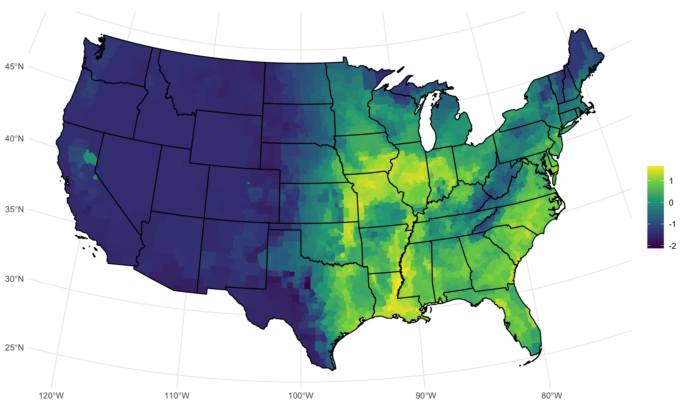

```


---
# Assigning treatment 

Eastern, rural counties above median attainable yield are "treated"
  
```{r trt_cntrl, out.width="90%"}

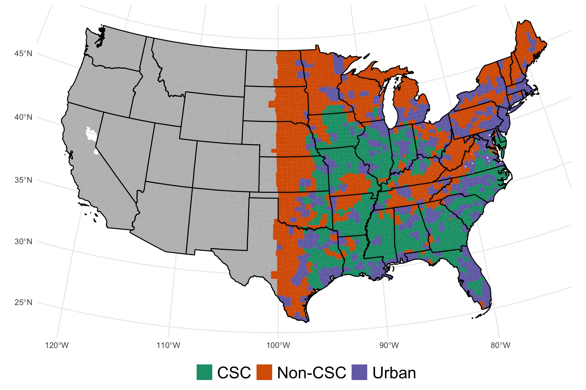

```


???

- Limit to rural counties east of the 100th meridian  
  - 80% of glyphosate is sprayed east of the 100th meridian 
  - Don't expect local effects from spraying on urban populations  
- Split counties above and below median high-low potential soy yield difference 
  (Results robust to moving this cutoff around and adding a buffer)


---
# Aggregating Upstream Treatment  

Proportion of upstream counties that are treated

```{r cnty_upstr_main, out.width = "90%"}

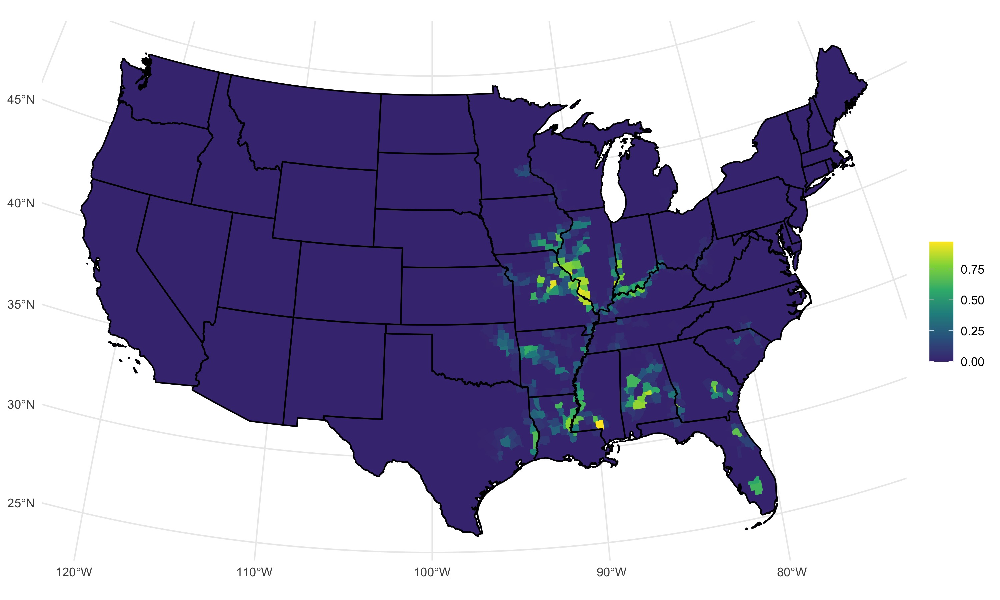

```


---
# Trends in glyphosate and births 

.pull-left[
### Glyphosate 
```{r}
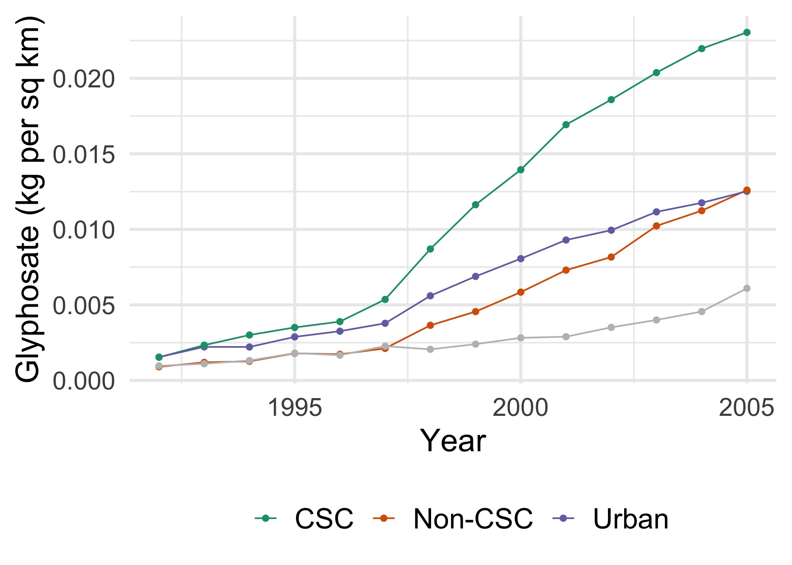
```
]

.pull-right[
### Median birth weight  
```{r}
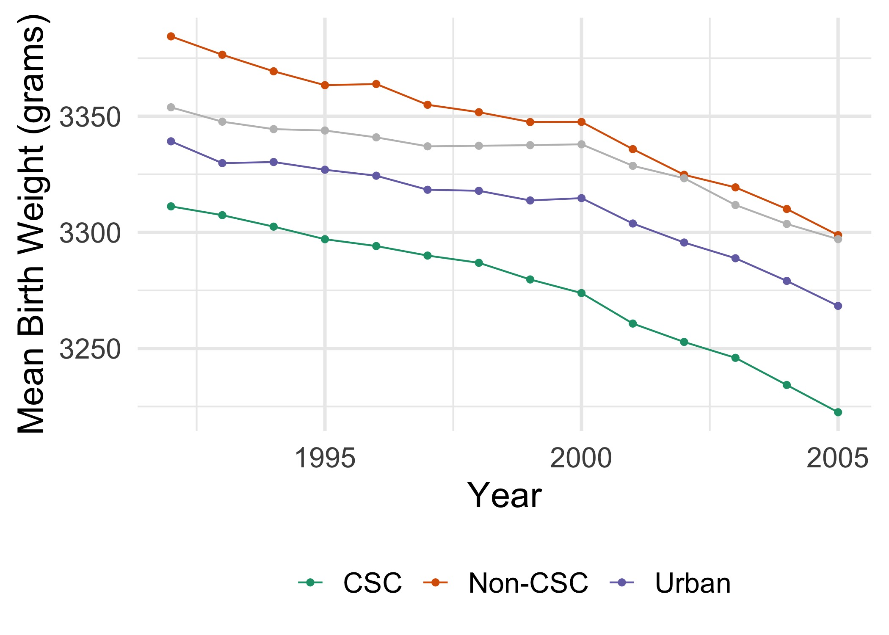
```
]

  

---
class: inverse, middle 
# Results 

---
# First stage effect on glyphosate

#### The effect of high GM yield on... 
</br>

.pull-left[
<center> **Local Glyphosate** </center>
```{r}

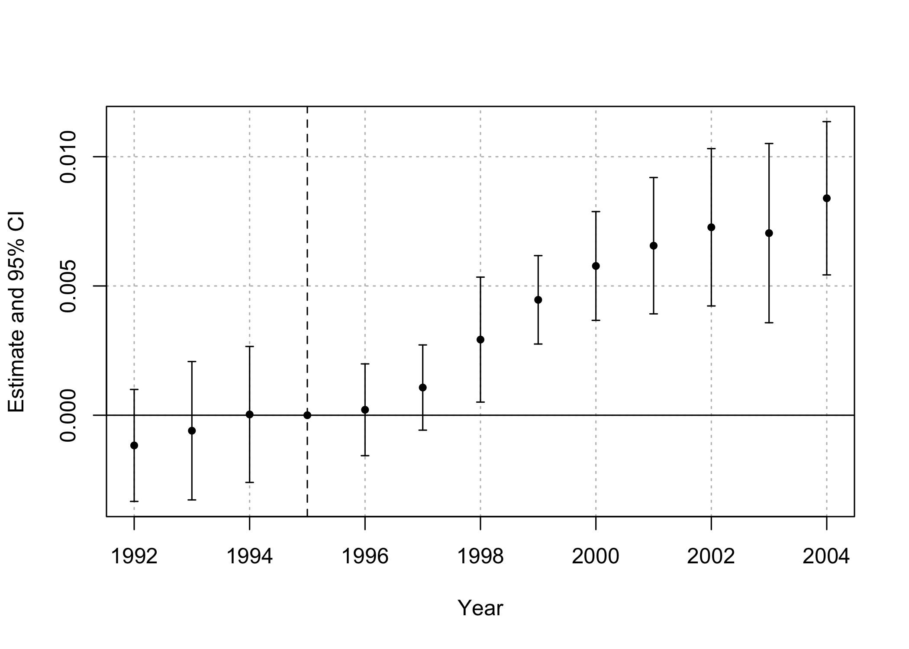

```
]

.pull-right[
<center> **Upstream Glyphosate** </center>
```{r}

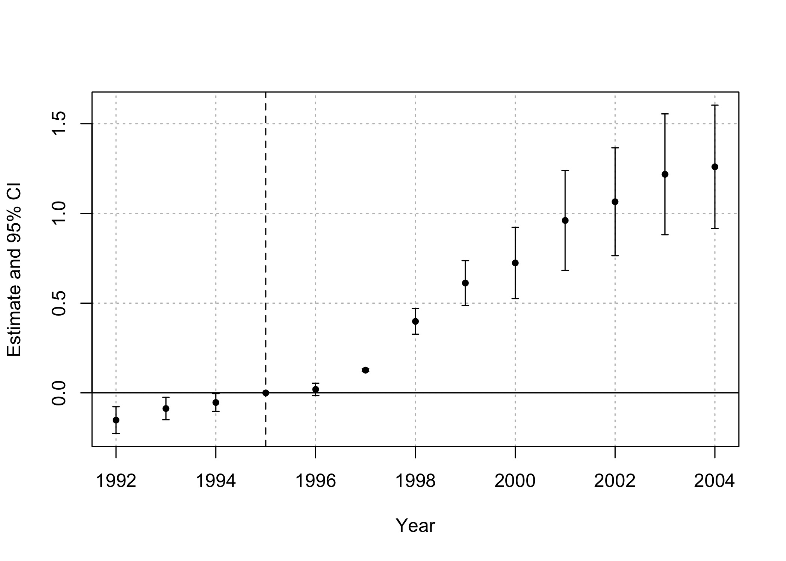

```

]

---
# Reduced form effect on birth weight

```{r, out.width = "80%"}

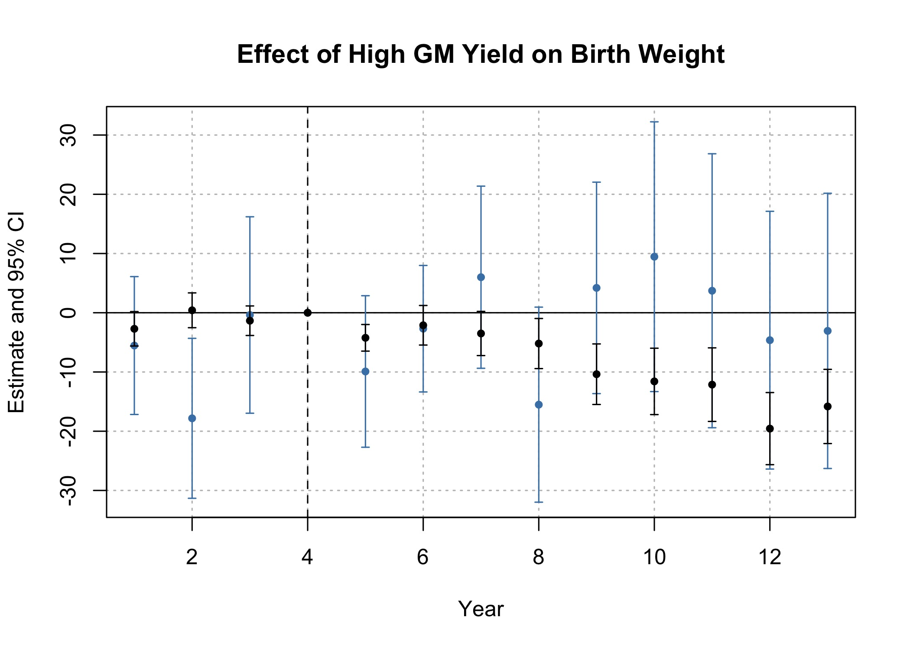

```


For **local** treatment and the .hi-blue[proportion upstream] that are treated

---
# TSLS estimates  

```{r}

controls_row = tribble(
  ~term, ~`1`, ~`2`, ~`3`,
  'Mother Controls', '', 'X', '',
  'Herbicide Controls', '', '', 'X',
  'F-Stat', 
  fitstat(iv_micro[[1]], type = "ivf1", simplify = TRUE)$stat |> 
    round(digits = 0) |> as.character(),
  fitstat(iv_micro[[2]], type = "ivf1", simplify = TRUE)$stat |> 
    round(digits = 0) |> as.character(),
  fitstat(iv_micro[[4]], type = "ivf1", simplify = TRUE)$stat |> 
    round(digits = 0) |> as.character()
)

modelsummary( 
  list(
    `1` = iv_micro[[1]],
    `2` = iv_micro[[2]],
    `3` = iv_micro[[4]]
  ),
  estimate =  "estimate", 
  statistic = "std.error",
  gof_omit='AIC|BIC|Log.Lik|R2',
  add_rows = controls_row,
  gof_map = tibble(
    raw = c("nobs"), #"FE: fips", "FE: year",
    clean = c("N"), #"FE: County","FE: Year",
    fmt = c(0),#NA,NA,
    omit = c(FALSE)), #TRUE,TRUE,
  fmt = 0,
  coef_map = c(
    "fit_glyph_km2"="Glyph per sq-km"
  ),
  stars = TRUE,
  #notes = "Standard errors are clustered by county and year.",
  title = "Effect of Glyphosate on Birth Weight"
) %>%
  kable_styling(bootstrap_options = "striped", full_width = FALSE) 

```

```{r, echo=FALSE}
# Moving from median to 90th percentile of glyphosate use in 2013
comb_9013_dt = read.fst(here("data-clean/comb-dt-period-90-13.fst"), as.data.table = T) 

glyph_quants =
  quantile(
    comb_9013_dt[year == 2004]$glyph_km2,
    probs = c(0.5, 0.9),
    na.rm = TRUE
  )

diff_glyph = diff(glyph_quants)

coef_interp = 
  abs(round(diff_glyph*coef(iv_micro[[2]])['fit_glyph_km2'],digits = 1))

```

Moving from the 50th to 90th percentile in glyphosate use in 2004 leads to a **`r coef_interp` gram decrease** in birth weights.


---
# Conclusion  

### Evidence of adverse health effects from glyphosate  
- Birth weights decrease in high GM suitability counties relative to low GM suitability counties after release of GM seeds in 1996  
- Results are robust to various specifications of treatment  

--

### Implications for policy  
- Results suggest we use more glyphosate than is socially optimal  
- But the net effect on welfare of regulation depends on many factors    


---
class: inverse, middle

# Thank you    

Emmett Saulnier  
[emmetts@uoregon.edu](mailto:emmetts@uoregon.edu)  
[https://www.emmettsaulnier.com/](https://www.emmettsaulnier.com/) 


---
class: inverse, middle

# Appendix  

---
# Balance table  

```{r balance table, out.width="100%"}

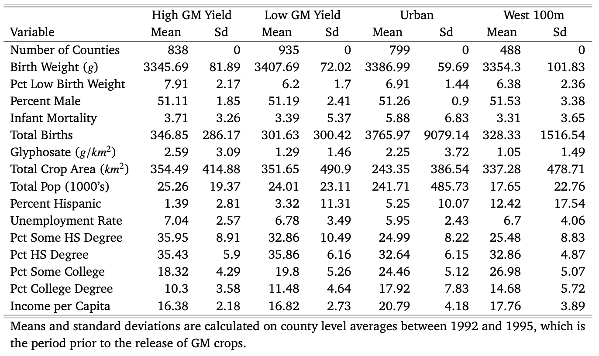

```


---
class: inverse, middle 
# Robustness


---
# Robustness: Different splits

```{r, out.width="85%"}

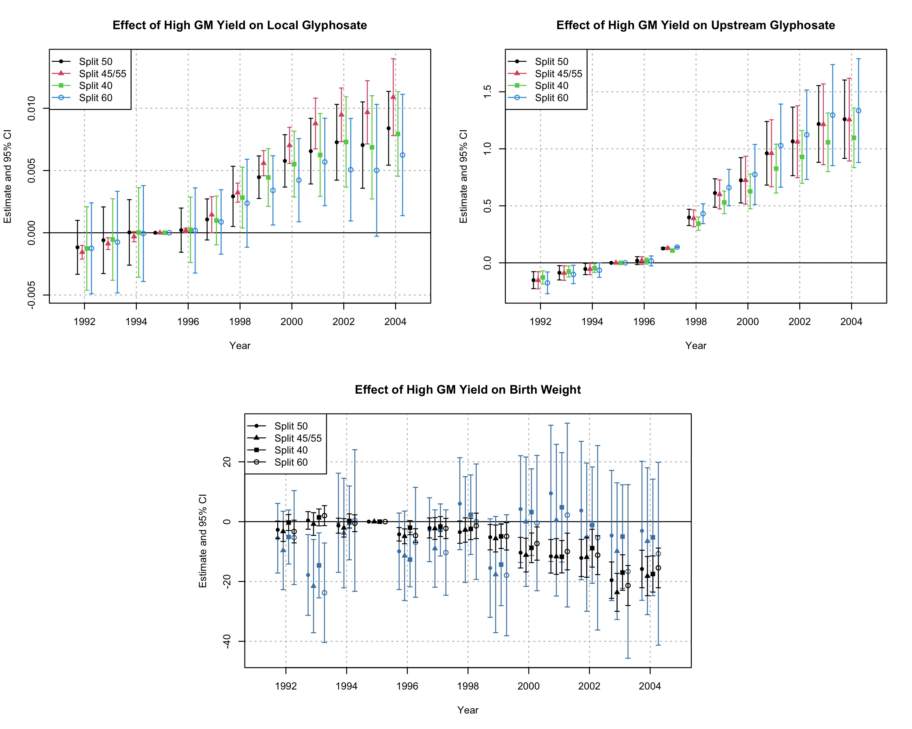

```


---
# Robustness: Soy Attainable Yield
```{r, out.width="85%"}
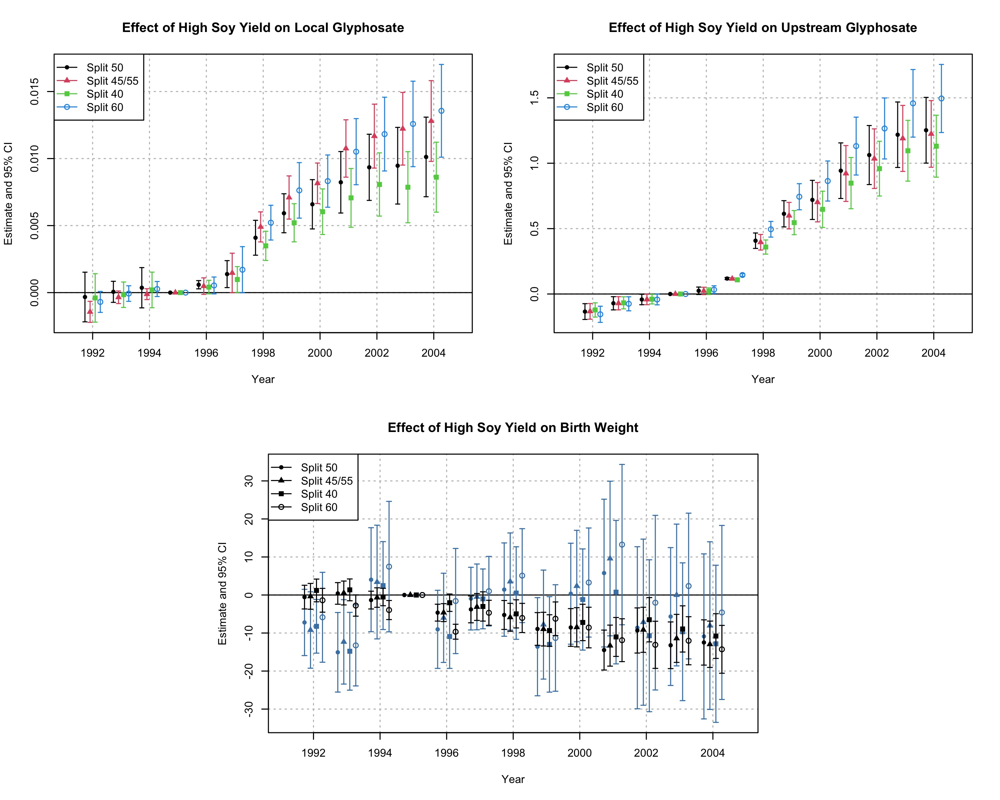
```

---
# Robustness: Entire country

```{r, out.width="85%"}

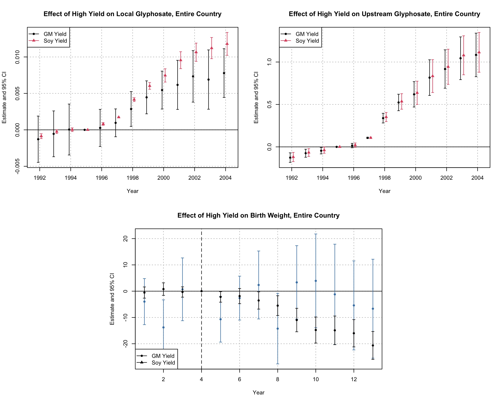
```


---
class: inverse, middle 

# Upstream vs Local Effects  


---
# Glyphosate in water   

**Concentration of Glyphosate in Water**  
```{r gly_con, out.width="90%"}

knitr::include_graphics("fig/glyph_concentrations.jpeg")

```

---
# Upstream vs Local Effects  

### What is the exposure mechanism?  
  - **Direct**: Occupational exposure during/after spraying  
  - **Drift**: Glyphosate particles blown around by the wind  
  - **Water**: Glyphosate particles dissolve into water and contaminate surface or ground water  


--

### Estimate upstream glyphosate  

- Link counties with a spatial water model  
- Aggregate upstream and downstream spraying  
- Also aggregate first stage predictions from exogenous regressors  

---
# Disaggregating to watersheds  

```{r wshd, out.width = "90%"}

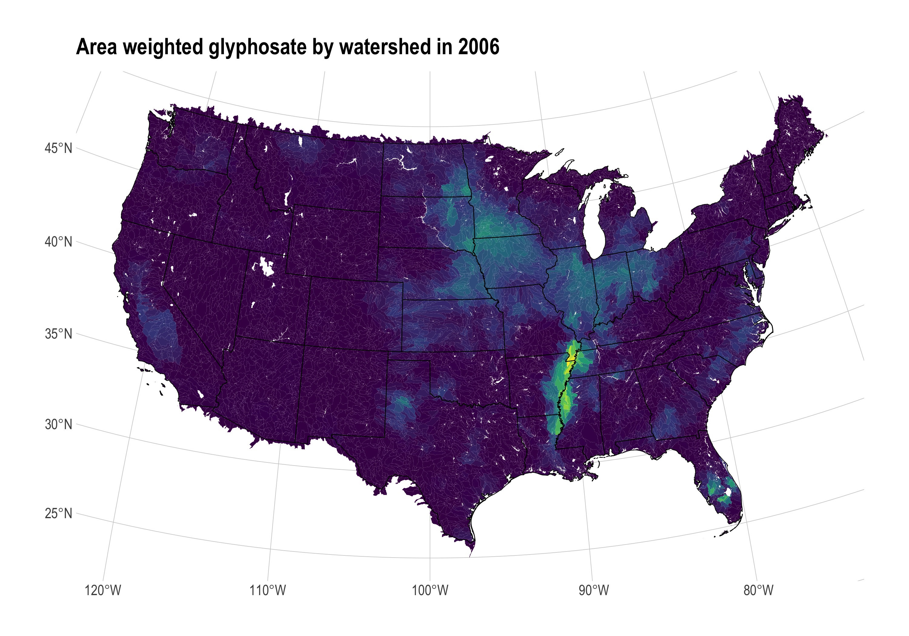

```

---
# Aggregating upstream glyphosate  
```{r upstr, out.width = "90%"}

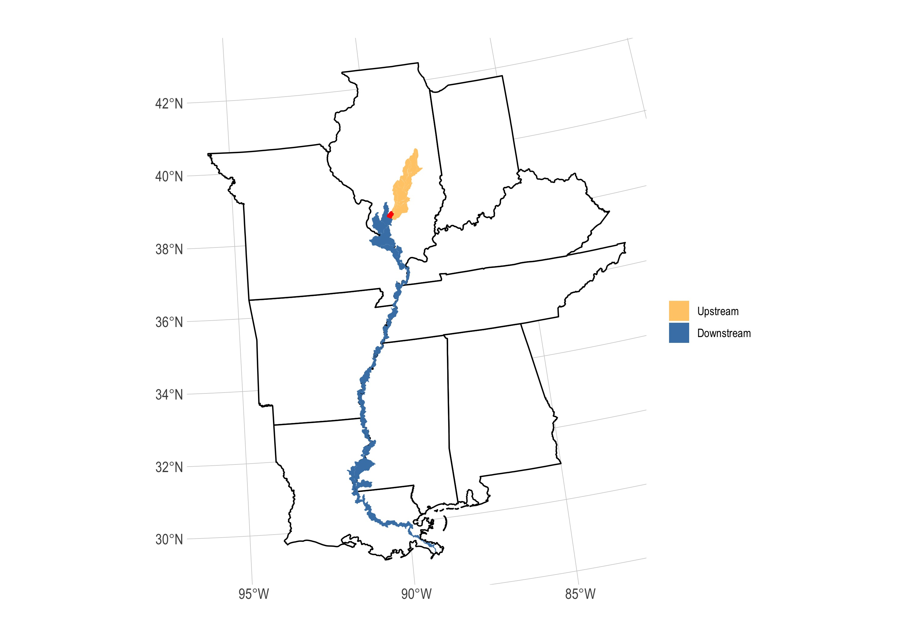

```


---
# Distance weighting 

```{r dist_wt, out.width = "90%"}

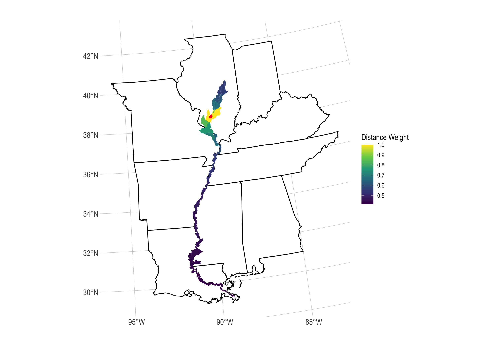

```

---
# Upstream Glyphosate  

```{r up_glyph, out.width = "90%"}

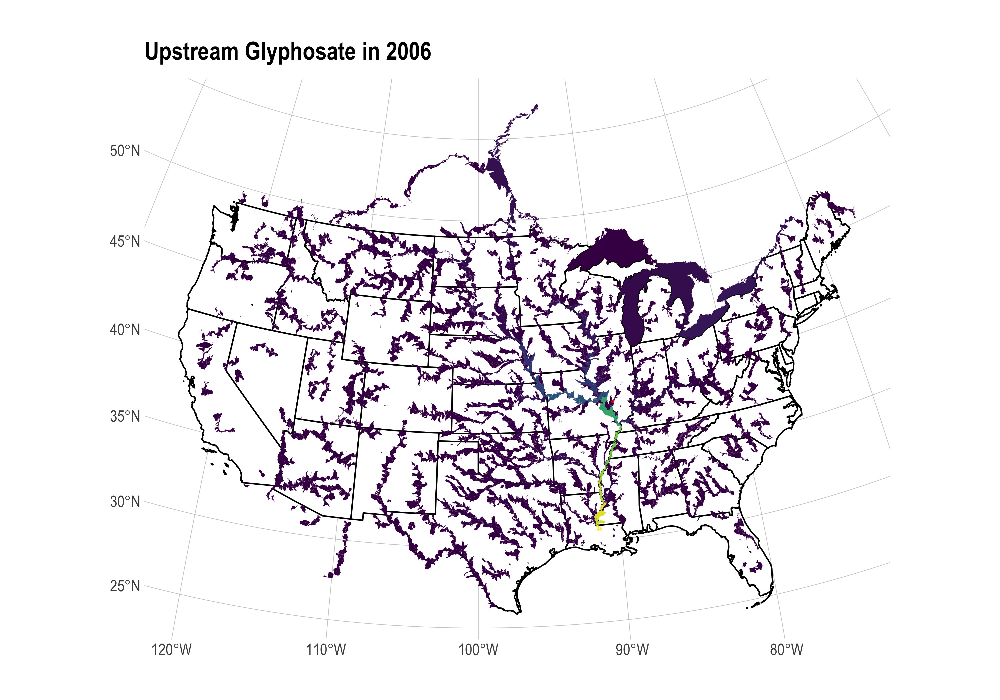

```

---
# Adding population weights

## Example: [Washington County, IL](https://www.google.com/maps/place/Washington+County,+IL/@38.4617302,-89.7591997,9.07z/data=!4m5!3m4!1s0x88768a8d689900b3:0xb49bcc523239591b!8m2!3d38.3988869!4d-89.3226954)
```{r cnty_exaple, out.width = "90%"}

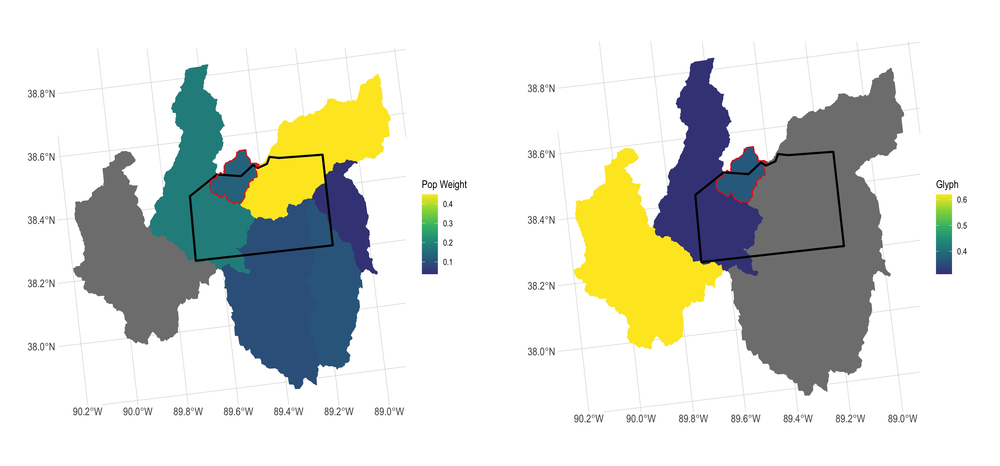

```


---
# Aggregating to county level  
```{r cnty_upstr, out.width = "90%"}

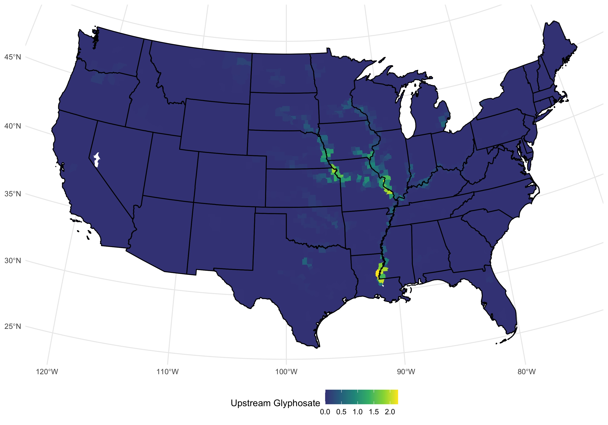

```


