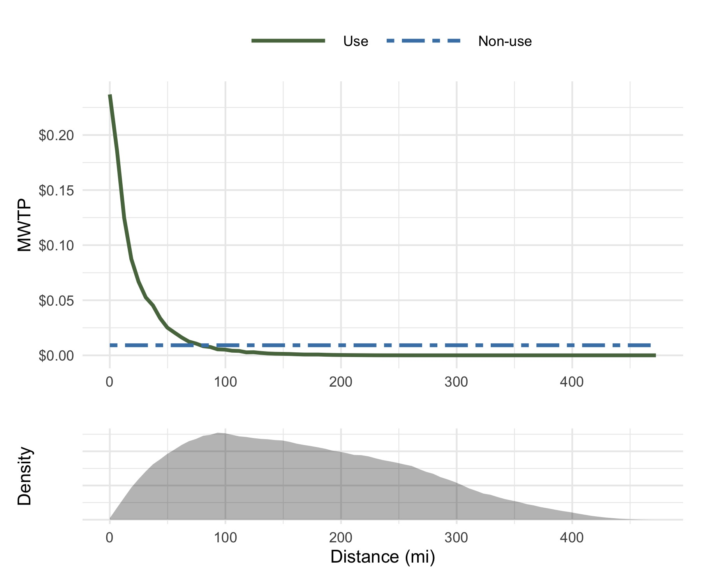
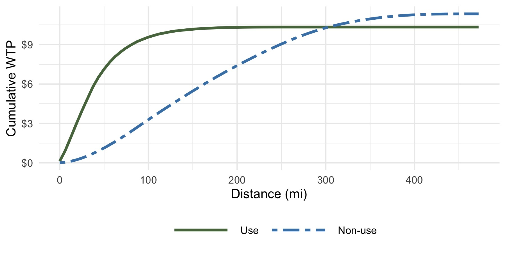
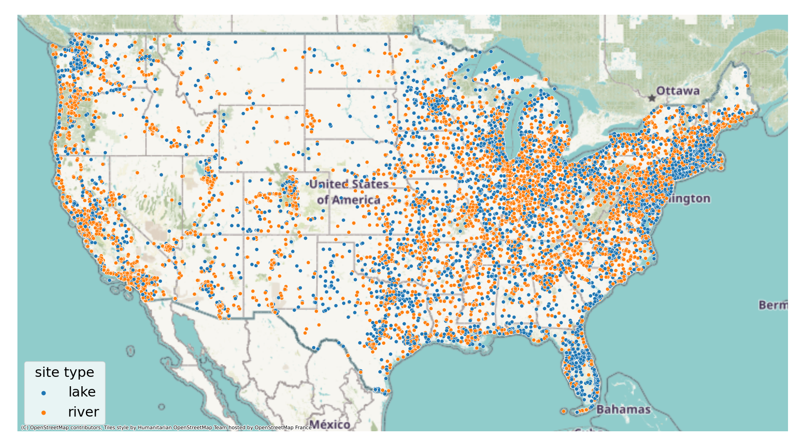
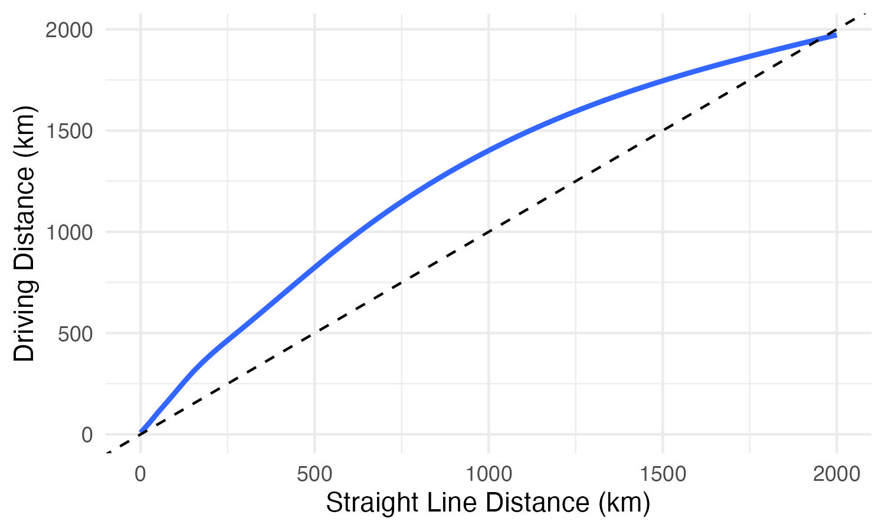
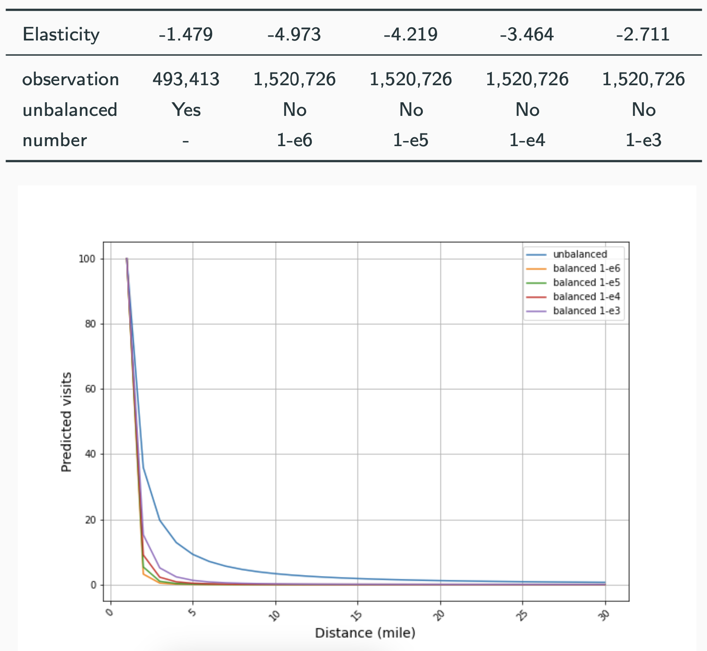
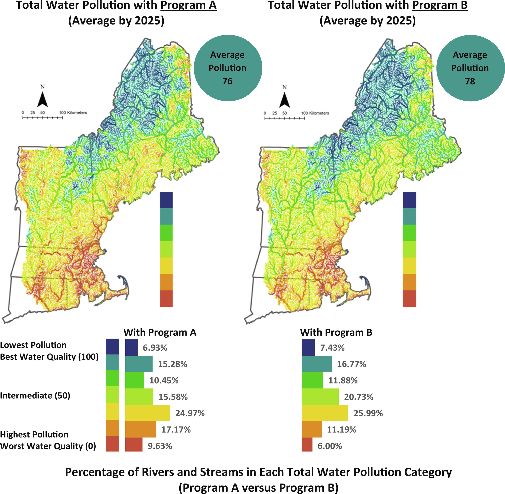

```{r setup, echo = FALSE, message = FALSE, output = FALSE, warning = FALSE}
knitr::opts_chunk$set(
  echo = FALSE, 
  message = FALSE, 
  warning = FALSE
)
library(pacman)
p_load(here)
here::i_am('04 Meeting/scwp-2024/reynier-scwp-2024.rmd')

```


name: motivation
# Water quality valuation  

The US EPA relies on a **metaanalysis-based benefit transfer function** to estimate the benefits of water quality improvements ([Corona et al. 2020](https://doi.org/10.3368/wple.96.4.478)).   

--

- Very difficult to incorporate a distance effect on WTP in the metaregression since it relies on aggregated data  
- Benefits are very sensitive to the **"analyst's choice"** for extent of market  
- Limit extent of market to 100 miles based on 1996 National Survey on Recreation, where about .hi-green[80% of all recreational uses] were within 100mi ([Viscusi et al. 2008](https://doi.org/10.1007/s10640-007-9186-4))  
- Perceived to be a **"conservative assumption"** that leaves considerable benefits on the table        

--

### More generally... 
- **Travel cost models** can inform us about the decay of .hi-green[use values]  
- We know **considerably less** about how distance affects .hi-blue[non-use values]  


---
# Our approach    

**Q** What is the relationship between distance and WTP for water quality? Does that relationship differ for use and non-use values?  

- Nest a .hi-green[travel cost random utility model] within a utility function that is also .hi-blue[directly affected by water quality], which can vary by distance      

--
- Estimate travel cost RUM with .hi-green[cell phone-based mobility data] on trips to water-based recreation sites  

--
- Combine with several .hi-blue[existing stated preference studies] to estimate rest of utility parameters  

--

### Preliminary Results    
- .hi-green[Use values decay quickly], over 90% of benefits captured within 100mi  
- .hi-blue[Non-use value decays much slower], and potentially not at all  


???

Largely follows [Kim and Lupi (2023)](https://doi.org/10.1017/age.2023.26) 
(currently [Johnston et al. 2023](https://doi.org/10.1073/pnas.2120255119) and [Vossler et al. 2023](https://doi.org/10.1073/pnas.2120251119))

---
class: inverse, middle 
# Structural decomposition of use and non-use values  

---
name: details-1
# Structural Model Details  

[Kim and Lupi (2023)](https://doi.org/10.1017/age.2023.26) propose a method for combining stated and revealed preferences to decompose use and non-use values. 
- Our goal is to take this model to survey data from **many studies**  
- Fill in missing visitation data with cell phone-based mobility data  

--

Person $i$'s utility conditional on visiting water feature $j$ in month $t$ and state of the world $s$ is     

$$u_{ijts} = \color{#57754D}{v_{ijts}^{\text{use}}} + \color{#4682B4}{v_{its}^{\text{nonuse}}} + v_{ijts}^{o} + \varepsilon_{ijts}$$

--

Numeraire is linear in income net of travel cost $p_{ij}$ and program cost $c_s$<sup>†</sup>  

$$v_{ijts}^o = \gamma(y_{it} - p_{ij} - c_s)$$


<div class="footnote">† The baseline case has \(c_0 = 0\).</div> 

---
name: details-2
# Structural Model Details 


.hi-green[Use Value] If person $i$ decides to visit site $j$, the utility they get is a site-time specific constant $\alpha_{jt}$ plus a vector representing site quality $q_{js}$  

$$\color{#57754D}{v_{ijts}^{\text{use}}} = \alpha_{jt} + q_{js}^\prime \beta$$ 

Thus, $\beta$ reflects the marginal use utility of quality. 


--

.hi-blue[Non-use Value] Non-use utility is the distance weighted sum across all sites, 

$$\color{#4682B4}{v_{its}^\text{nonuse}} = \sum_{j} (d_{ij} + 1)^\lambda(a_{jt} + q_{js}^\prime b)$$

where $d_{ij}$ is distance between $i$ and $j$, $\lambda$ is the rate of decay, and $b$ is the marginal non-use utility of quality. **Does not depend on actual site choice!**

--

People .hi-green[visit the sites] with the highest indirect utility. They then vote on the proposed policy from the sum of their **expected use and non-use utility**. 


---
name: details-3
# Structural Model Details  


### Welfare measures  

We can calculate WTP for a given water quality change $\Delta q$ as 

\begin{align*}
&\color{#57754D}{WTP^\text{use}_i} = \frac{1}{\gamma}\sum_t\log{\left[\frac{\sum_j \exp{\left(\tilde{\alpha}_{jt} + \Delta q_j^\prime \beta - \gamma p_{ij}\right)}}{\sum_j \exp{\left(\tilde{\alpha}_{jt} - \gamma p_{ij}\right)}}\right]} \\
&\color{#4682B4}{WTP^\text{nonuse}_i} = \frac{1}{\gamma}\sum_t\sum_j (d_{ij} + 1)^\lambda \Delta q_j^\prime b
\end{align*}


both of which vary as respondents get further from a given water feature.<sup>†</sup>

<div class="footnote">† Travel costs \(p_{ij}\) are a non-linear function of driving distance</div>


---
class: inverse, middle

# Estimation Strategy  

---
name: est-main
# Estimation Strategy  

.footnote[[[RP details]](#app-model-rp) [[SP details]](#app-model-sp)]

We can make distributional assumptions to derive a [likelihood function](#app-likelihood) and estimate the parameters via MLE---this requires four key pieces of data  

1. Characteristics of the proposed policy (i.e. cost and $\Delta$ water quality)   
2. **Distance** between respondents and water quality improvements  
3. Respondent's .hi-blue[vote yes/no for the proposed program]  
4. Respondent's .hi-green[site visitation behavior] 

--

It is relatively low effort to produce 1-3 from existing stated preference studies, but most would not have **specific site visitation data**.

--

$\implies$ We want to use .hi-green[cell data] to fill in missing visitation behavior  

---
# Our Approach  

We'd like to jointly estimate all of the parameters in the model. However, we have first done things in two steps to get preliminary results: 

1. Estimate mean utilities, $\delta_{jt} = \alpha_{jt} + q^\prime_j\beta$ and the marginal utility of income, $\gamma$, using .hi-green[travel cost RUM with cell data]  
2. Take $\hat{\delta}$'s and $\hat{\gamma}$ as given in .hi-blue[MLE with stated preference data] to estimate rest of utility parameters $\theta = \{\beta, b, \lambda, \sigma^{SP}\}$

--

\begin{equation*}
  \tilde{v}_{is} = \kappa + \left(v^{nonuse}_{is} + \color{#57754D}{E\left[v^{use}_{is} + v^o_{is}\right]}\right)\frac{1}{\sigma^{SP}} 
  %\text{where} \quad \color{#57754D}{E\left[v^{use}_{is} + v^o_{is}\right]} = \sum_t \log{\sum_j \exp{\left(\hat{\alpha}_{jt} + q_{js}^\prime \beta + \hat{\gamma}\left(y_{i} - p_{ij} - c_s\right)\right)}}
\end{equation*}

where $\color{#57754D}{E\left[v^{use}_{is} + v^o_{is}\right]} = \sum_t \log{\sum_j \exp{\left(\hat{\alpha}_{jt} + q_{js}^\prime \beta + \hat{\gamma}\left(y_{i} - p_{ij} - c_s\right)\right)}}$ 


---
class: inverse, middle 
# Data     


---
name: main-cell-data
# Cell phone mobility data 

#### Patterns data from Advan (formerly SafeGraph) 
- Aggregated monthly visits from CBGs to POIs in 2022   
- Follow [Wan et al (2024)](https://www.doi.org/10.1088/1748-9326/ad801c) in selecting 69K water-based recreation sites by intersecting Advan park POIs with NHDv2 .smallest[[[details]](#app-cell-data-poi)] .smallest[[[map]](#app-poi-map)]  
- Aggregate sites to HUC12 level   

--

#### Dealing with zero share issues  
1. **Unbalanced Panel**: Drop CBG-HUC12-month's with zero visits  
2. **Balanced Panel**: Use empirical Bayes estimator as in [Li (2023)](https://jingli-econ.github.io/documents/papers/li_evcompatibility.pdf) or add a small number of visits to zero-visit sites   


--

We calculate **60 million** driving distances between CBG and HUC12 centroids using the Open Source Routing Machine (OSRM) .smallest[[[details]](#app-osrm) [[travel cost function]](#app-travel-costs)]  

???

#### Picking water-recreation POIs .not-bold[.smallest[[[details]](#app-cell-data-poi)]]  

---
name: main-survey-data  
# Stated preference data  

We are greatful to the authors of two studies who have shared microdata from their studies with us, [Johnston et al. (2023)](https://doi.org/10.1073/pnas.2120255119) and [Vossler et al. (2023)](https://doi.org/10.1073/pnas.2120251119).  

**Today's results only use the Johnston et al. data.** .smallest[.not-bold[[[details]](#app-johnston)]]  

--

- Focused on New England  
- Survey instrument compares BAU to alternative policy scenarios in 2025   
- Model three different water quality metrics using FRAMES  
- We use their overall WQI as our measure of water quality  

???


### Vossler et al. (2023) .smallest[.not-bold[[[details]](#app-vossler)]]
- Focused on the upper-midwest  
- Values improvements in the Biological Condition Gradient (BCG) 
- Explore value for local vs non-local improvements 

---
# Stated preference data  


```{r johnston-map, out.width = "63%", fig.align = "center"}
library(magick)

# Read and trim the image
img <- image_read('figs/mean-utility-decomp-wq-map.jpeg') |> 
       image_trim()

# Save the trimmed image
image_write(img, path = 'figs/mean-utility-decomp-wq-map-cropped.jpeg')

# Include the trimmed image in the RMarkdown document
knitr::include_graphics('figs/mean-utility-decomp-wq-map-cropped.jpeg')
```


---
class: inverse, middle 
# Estimation Results  


---
# Estimation Results: Stated Preferences 

Preliminary parameter estimates: 

| **Parameter**   | **Estimate**  |
|:-------------:|-----------:|
| $\gamma$     | 0.021     |
| $\beta$     | 93.68     |
| $b$         | 0.09      |
| $\lambda$   | -3.3e-9   |
| $\sigma^{RP}$| 55.90     |


--

To put these results into context, 
- [Johnston et al. (2023)](https://doi.org/10.1073/pnas.2120255119) find $12.2 WTP for 1pt improvement in region-wide WQ, our model suggests **$26.4**, of which .hi-blue[36% is non-use]  
- [Corona et al. (2020)](https://doi.org/10.3368/wple.96.4.478) find $3.1 WTP for 1pt improvement in a HUC4, median across HUC4's in our model is **$2.4**, of which .hi-blue[42% is non-use]    


---
class: inverse, middle 
# Results  


---
# MWTP for 1pt WQ in a HUC12  

```{r mwtp, fig.align= "center", out.width = "85%"}

```


???

We plot the WTP functions for a 1pt improvement in a HUC12, integrated over all individuals and watersheds in the sample.

---
# Cumulative WTP for 1pt WQ by distance  

We can plot the cumulative WTP for survey respondents as we get further from the HUC12 seeing a water quality improvement,  
```{r wtp, fig.align="center", out.width = "85%"}


```

At 100 miles, we caputure .hi-green[92% of total use value], but only .hi-blue[29% of non-use value], or **59%** of total WTP. 

---
# Conclusions  

### Implications for benefits estimation  
- Non-use values are low, may not decay much with distance  
- The radius-based extent of market captures nearly all .hi-green[use value], but leaves a considerable amount of .hi-blue[non-use value] on the table  
  
--

### Next steps  
- Estimate all parameters jointly  
- Integrate more stated preference studies, and figure out how to handle the host of estimation complexities that brings   
- Specify richer, more flexible utility model  


---

class: inverse, middle

# Thank you! 

### Emmett Reynier  
PhD Candidate, University of Oregon  
ORISE Research Fellow, US EPA Office of Water   
[https://www.emmettreynier.com](https://www.emmettreynier.com)  

---
class: inverse, middle
# Appendix 


---
name: app-model-rp
# Model Details: Revealed Preferences   

Assume that trips occur in the baseline period, $s=0$ before quality change. Then the probability $i$ visits $j$ is 

\begin{align}
  Pr^{visit}_{ijt0} &= Pr(u_{ijt0} - u_{ikt0} > 0)  \quad \forall \; k \neq j \\
  &= Pr\left[(v_{ijt0}^{\text{use}} + v_{it0}^{\text{nonuse}} + v_{ijt0}^{o}) - (v_{ikt0}^{\text{use}} + v_{it0}^{\text{nonuse}} + v_{ikt0}^{o}) > \varepsilon_{ikt0} - \varepsilon_{ijt0}\right] \\
  &= Pr\left[(v_{ijt0}^{\text{use}} + v_{ijt0}^{o}) - (v_{ikt0}^{\text{use}} + v_{ikt0}^{o}) > \varepsilon_{ikt0} - \varepsilon_{ijt0}\right] \quad \forall \; k \neq j
\end{align}

The non-use values cancel out since they do not depend on choice $j$. Given T1EV errors, we have 

$$Pr^{visit}_{ijts} = \frac{\exp{\left(\alpha_{jt} + q_{js}^\prime\beta - \gamma (y_{it} - p_{ij} - c_s)\right)}}{\sum_{k}\exp{\left(\alpha_{kt} + q_{ks}^\prime\beta - \gamma (y_{it} - p_{ik} - c_s)\right)}}$$


.footnote[[[return]](#details-3)]

---
name: app-model-sp 
# Model Details: Stated Preferences   

### Stated preference portion  

The utility $i$ receives from state of the world $s$ is 

$$u_{is} = \tilde{v}_{is} + \tilde{\varepsilon}_{is} = T\tilde{v}_{is} + \sum_t\tilde{\varepsilon}_{its}$$  

where $\tilde{v}_{is}$ is the deterministic portion of utility, 

$$\tilde{v}_{is} = \frac{1}{\sigma^{SP}} \left(v^\text{nonuse}_{is} +  \sum_j \exp{\left(v^\text{use}_{ijs} + v^o_{ijs}\right)}\right) + \kappa$$

$\sigma^{SP}$ is the variance of T1EV shock and the left terms are expected use-utility in state $s$ with constant of integration $\kappa$. Household $i$ will choose the change scenario $s=1$ with probability 

$$Pr^{vote}_{i1}(u_{i1} > u_{i0}) = Pr\left(\tilde{v}_{i1} - \tilde{v}_{i0}> \tilde{\varepsilon}_{i1} - \tilde{\varepsilon}_{i0}\right)$$

.footnote[[[return]](#details-3)]


---
name: app-likelihood
# Likelihood Function 

Calculate log-likelihood as  

$$ll_i = \sum_t\sum_j Y_{ijt}\log{Pr^{\text{visit}}_{ijt}} + \sum_s Y_{is}\log{Pr_{is}^{\text{vote}}},$$


where $Y_{ijt}$ and $Y_{is}$ are the actual visit choices and vote choices respectively. 


.footnote[[[return]](#est-main)]

---
name: app-cell-data-privacy
# Advan privacy protection measures  

Advan implements the following procedure to protect user's privacy:  
1. Differential privacy: add a Laplane noise with $N(0,10/9)$  
1. Discretization: round the number to integer  
1. Integer Floor: present a visitor count if $floor(V_{ijt})$ is larger than $2$ 
2. Censoring: $\max\{4, \text{floor}(V_{ijt})\}$

In-progress work suggests that these techniques may lead to bias using standard estimation techniques. 

.footnote[[[return]](#main-cell-data)]

---
name: app-cell-data-poi  
# Identifying Water POIs  

We intersect the Advan parks polygon (NAICS code 712190) with the NHDv2:   
- Create 50 meter buffer around park polygons  
- Create 20 meter buffer around river flowlines  
- Identify lake-based sites as those adjacent to a water body  

#### A few important caveats  

1. Difficult to identify river visits (esp. river sites across states)  
2. Aggregation of sites to HUC12 may be a concern: the partial aggregation approach reasonably approximates the results of a disaggregate model (Lupi and Feather (1988), Daniel Phaneuf's recent work with EPA grants)
3. Represents approximately 10% of all smartphones  
4. Tends to represent a younger demographic than the general population  
5. Mobile GPS positioning may have ~5 meter errors  

.footnote[[[return]](#main-cell-data)]

---
name: app-poi-map
# Map of Water-Based POIs


```{r poi-map}
# Put map of POI

```

.footnote[[[return]](#main-cell-data)]

---
name: app-osrm
# Driving Distances with OSRM  

We use the [Open Source Routing Machine (OSRM)](https://project-osrm.org/) to calculate the shortest driving distance between CBG and water-based POI site centroids.  
- Getting OSRM to run nationally requires ~100gb of RAM in inital setup (used virtual machine on Google Compute Engine)    
- Fed it 60 million lat/lon pairs and waited for 3 days...  

```{r osrm-distr, out.width = "70%", fig.align="center"}



```


.footnote[[[return]](#main-cell-data)]


---
name: app-travel-costs  
# Calculating Travel Costs  

We use the following formula to calculate travel costs: 

$$TC_{ijt} =2\left(gs_{it} + f_t\right)\text{Dist}_{ijt} +2\gamma \frac{\text{Medinc}_i}{2080} \text{Time}_{ijt}$$  

where...
- $\text{Dist}_{ijt}$ and $\text{time}_{ijt}$ are one-way travel distance and time between the centroid of CBG $i$ and HUC12 $j$ in period $t$   
- $gs_{it}$ is state-level average gas cost in year $t$   
- $f_t$ is marginal vehicle maintenance cost, repair cost, and depreciation   
- $\frac{\text{Medinc}_i}{2080}$ is median annual income CBG $i$, converted to hourly wages     
- $\gamma = \frac{1}{3}$ for central estimate, with robustness checks  
- Travel time: replace missing values with travel distance/38.5  

.footnote[[[return]](#main-cell-data)]

---
# Reduced form results with cell data   

We begin with some simple regressions measuring distance decay in use values with the cell-phone data: 

$$\log{\text{Visit}_{ijt}} = \beta \log{d_{ij}} + \text{zip}_i + \text{site}_j + \text{ym}_t + \varepsilon_{ijt}$$

where
- $\text{Visit}_{ijt}$ are monthly visits (normalized by number of devices in origin)  
- $d_{ij}$ is driving distance from zip code $i$ to a HUC12 $j$  
- $\text{zip}_i$ and $\text{site}_j$ are origin and destination fixed effects  
- $\text{ym}_t$ are year-month fixed effects  


---
# Reduced form results 


```{r reduced-form-1, out.width = "75%", fig.align= "center"}

```


---
name: app-travel-cost-full
# Estimation Results: Travel Cost RUM  

Estimates for the **marginal utility of income** $\gamma$ using cell data:   


|                         | (1)         | **(2)**     | (3)         | (4)         | (5)         | (6)         |
|-------------------------|-------------|-------------|-------------|-------------|-------------|-------------|
| **Travel Cost**        | -0.015***   | **-0.021***** | -0.025*** | -0.018***   | -0.011***   | -0.004***   |
|                         | (0.000)     | (0.000)     | (0.000)     | (0.000)     | (0.000)     | (0.000)     |
|                                                                                                             |
| **Observations**        | 493,413     | 1,520,726   | 1,520,726   | 1,520,726   | 1,520,726   | 1,520,726   |
| **N (Zipcode)**         | 727         | 727         | 727         | 727         | 727         | 727         |
| **Unbalanced**          | Yes         | No          | No          | No          | No          | No          |
| **Share**               | -           | Bayes       | 1-e6        | 1-e5        | 1-e4        | 1-e3        |  


- Use GMM estimator to solve the market share system  
- Instruments for travel costs with interaction between state and crude oil price, and travel distance  
- Get similar results modeling $\gamma_i$ as a random coefficient 

.footnote[\* significant at 1% level [[return]](#est-travel-cost)]

---
name: app-johnston 
# Johnston et al. PNAS 2023 details 

```{r johnston-figs, out.width = "65%", fig.align = "center"}



```


.footnote[[[return]](#main-survey-data)]


???

https://doi.org/10.1073/pnas.2120255119

---
name: app-vossler 
# Vossler et al. PNAS 2023 details 


```{r vossler-figs, out.width = "65%", fig.align = "center"}

knitr::include_graphics('figs/vossler-map.jpg')

```

.footnote[[[return]](#main-survey-data)]

???

https://doi.org/10.1073/pnas.2120251119

